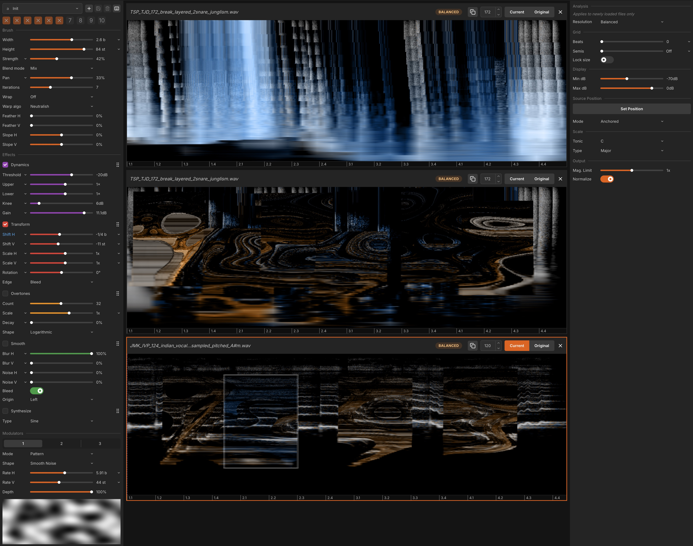

# Noise Canvas

Noise Canvas is a standalone tool for doing sound design that works a bit like Photoshop for audio.
It lets you load audio files, view them as **spectrograms**, and directly paint transformations and effects onto the sound.

The interface is built around **brushes**, **modulation**, **presets**, and a range of parameters that let you shape time, frequency, and stereo in real time.

Keep reading for a **beautiful** and **perfectly formatted** ChatGPT summary of me rambling for 10 minutes about Noise Canvas, full of **randomly bolded** words and **emdashes**.

Otherwise just open it up and play around. All the parameters have got tooltips. I'm of the belief that how to use a tool should be mostly obvious just by using it. If it's not then I need to fix something.



---

## Getting Started

Go to the **Releases** section on GitHub, and download the file for your platform.

Once installed, you can open audio files, paint effects directly onto their spectrograms, and hear the results instantly. It should be fairly intuitive.

### Important: Code Signing, Certificates, and “Scary” OS Warnings

Noise Canvas is **free software** — and that means I’m not paying for expensive signing certificates.

When software is “properly signed,” it’s linked to a digital certificate that tells your operating system _exactly who built it_.  
Those certificates cost money and for a free app, I'm just not going to do that soz.

So basically Noise Canvas is **unsigned**, which means your OS will complain the first time you open it.  
You’ll need to manually approve it once — after that, it’ll open normally.

#### On Windows

1. When you first open the installer or `.exe`, Windows will show a warning like:  
   “Windows protected your PC” or “Unknown publisher.”
2. Click **More Info**.
3. Then click **Run Anyway** or **Open Anyway**.

That’s it — the app will launch. Windows will remember your choice for next time.

#### On macOS

1. Try to open the app normally. macOS will block it and say it’s from an unidentified developer.
2. Go to **System Settings → Privacy & Security**.
3. Scroll down to the **Security** section.
4. You’ll see “Noise Canvas was blocked from opening” with an **Open Anyway** button. Click that.
5. macOS will ask again; confirm with **Open Anyway**.

After that, it’ll open fine forever.

If you trust me — great! If you don’t, I'm not exactly anonymous. If Noise Canvas does something dodgy you can trash me on instagram. Also the code is visible to all so you can see I'm not doing anything bad.

Eventually I might pay for a certificate and sign the binary properly, but for now you’ll just have to live with it if you want those sick spectral sounds. Sorry!

---

## Table of Contents

1. [Core Concepts](#core-concepts)
2. [Brushes and Effects](#brushes-and-effects)
   - [Shared Brush Parameters](#shared-brush-parameters)
   - [Available Effects](#available-effects)
   - [Blend Modes](#blend-modes)

3. [Modulation](#modulation)
4. [Presets and Quick Slots](#presets-and-quick-slots)
5. [Working with Multiple Files](#working-with-multiple-files)
6. [Analysis and Display](#analysis-and-display)
7. [Output and Playback](#output-and-playback)
8. [File Menu](#file-menu)
9. [Integration with Ableton Live](#integration-with-ableton-live)
10. [Technical Overview](#technical-overview)
11. [Status](#status)
12. [Contributing](#contributing)
13. [Building](#building)
14. [Credits](#credits)
15. [License](#license)

---

## Core Concepts

At its heart, Noise Canvas is about **painting sound directly into a spectrogram**.

A spectrogram is a visual representation of sound where:

- The **horizontal axis** is **time** (measured in beats)
- The **vertical axis** is **pitch** (measured in semitones)
- The **brightness or color** represents **amplitude**

When you load an audio file, Noise Canvas analyzes it into this form using the **Constant-Q Transform (CQT)** — which gives a musically intuitive frequency layout.
Instead of abstract FFT bins, you’re working in **beats and notes**. That means everything you draw, erase, blur, shift, or distort corresponds directly to musical structure.

The workflow is simple:

1. Load a sound.
2. Pick an effect (or several).
3. Paint across time and pitch.
4. Hear the results instantly.

This approach makes sound design tangible — almost physical. You’re literally **painting timbre**.

You can load **multiple audio files** at once, and choose which one acts as the source (where data is pulled from) and which as the target (where data is painted to).
Undo, redo, and versioned saving let you experiment freely without fear of breaking anything.

---

## Brushes and Effects

Everything in Noise Canvas revolves around the brush — it’s the link between what you see and what you hear.

When you paint, the brush defines **where** and **how strongly** an effect is applied to the spectrogram.
Effects are modular: you can enable multiple ones at once, tweak them independently, and reorder them to change their processing order.

Each stroke applies transformations directly to the spectral data of the sound.

---

### Shared Brush Parameters

All brushes and effects share a set of core controls:

- **Width** – horizontal (time) size of the brush in beats.
- **Height** – vertical (pitch) size in semitones.
- **Strength** – how strongly the effect applies.
- **Iterations** – how many times the effect recursively applies (feedback loops, echoes, spectral delays, etc.).
- **Pan** – stereo positioning or left/right balance of processing.
- **Blend Mode** – how the processed and original spectrogram are combined.
- **Wrapping** – defines behavior when painting off the canvas edges:
  - None – paint stops at the edge.
  - Wrap Time – repeats horizontally.
  - Wrap Time + Pitch – repeats both horizontally and vertically.

- **Warp Algorithm** – different resynthesis strategies for reconstructing sound after edits.
  These aren’t perfect — each produces unique artifacts. Pick what sounds best.
- **Feathering** – softens brush edges in both time and pitch.
  - Maximum feather = softest edges.
  - **Feather slope** adjusts how the transition fades:
    - -100%: fades from top to bottom.
    - 0%: symmetrical fade.
    - +100%: fades from bottom to top.

---

### Available Effects

You can enable any combination of effects at once and change their order using the dots icon in the top-right corner of each panel.

#### Dynamics

Controls amplitude, compression, and gating directly in the spectrogram domain.

- **Threshold** – amplitude threshold.
- **Upper Ratio** – compression ratio above the threshold.
- **Lower Ratio** – expansion ratio below the threshold.
- **Knee** – smoothness of the transition around the threshold.
- **Gain** - overall gain to apply.

Together, these allow everything from subtle dynamic shaping to hard gating, expansion and inverting the amplitude.

#### Transform

Shifts, scales, or rotates the spectral image.

- **Shift Horizontal / Vertical** – move content in time or pitch.
- **Scale Horizontal / Vertical** – stretch or compress.
- **Rotate** – rotate the selection.
- **Edge Mode** – determines what happens at the brush borders:
  - **Cut** – anything moved outside is cut off.
  - **Bleed** – pulls in content from surrounding areas.
  - **Wrap** – wraps content around edges.
  - **Mirror** – wraps but alternates flips (ping-pong style).

#### Overtones

Adds harmonic or inharmonic overtones to the painted region.

- **Count** – number of harmonics.
- **Scale** – vertical spacing between harmonics.
- **Decay** – how amplitude decreases per overtone.
- **Shape** – harmonic relationship type:
  - Logarithmic – natural harmonic series.
  - Exponential – octave series.
  - Selected Scale – uses the chosen musical scale.

#### Smooth

Spectral blurring for echo, reverb, and diffusion-like effects.

- **Blur Horizontal / Vertical** – degree of blur in time/pitch.
- **Noise Horizontal / Vertical** – random scattering to make the blur more diffuse.
- **Bleed** – allows smoothing beyond brush borders.
- **Origin** – defines where blur radiates from:
  - Left – forward reverb.
  - Middle – symmetrical reverb.
  - Right – reversed reverb/echo.

#### Synthesize

Fills the brushed area with generated material.

- **Type** – noise or sine (sine currently produces interesting artifacts).

---

### Blend Modes

How the processed data merges with the original spectrogram:

- **Mix** – normal crossfade.
- **Add** – adds the processed signal.
- **Subtract** – removes the processed values.
- **Multiply / Divide** – scale relationships.
- **Maximum / Minimum** – keep stronger or weaker values.
- **Difference** – absolute difference between source and result.
- **Dissolve** – noisy probabilistic mixing similar to Photoshop’s dissolve mode.

---

## Modulation

Noise Canvas has a flexible modulation system for automating parameters in time and pitch.  
Anywhere you see a small dropdown icon on a parameter label, that parameter is modulatable. You can run up to **three modulators** at once.

### How Modulation Amount Works

This isn’t an “add some LFO on top” system. Think of it as **crossfading between the parameter’s slider value and a fully modulated value that is always clamped to the parameter’s legal range**.

- **Amount = 0%** → The parameter is **exactly** the value you set on its slider. No modulation is applied.
- **Amount = +100%** → The parameter ignores the slider and takes **pure modulation**, mapped from **that parameter’s minimum up to its maximum**. It **never** goes out of range.
- **Amount = −100%** → Same as +100% but **inverted**: the modulator is mapped from **maximum down to minimum**.
- **Amounts between −100% and +100%** blend between the slider value and the modulated value.

In other words, **Amount** controls “how much of the original slider value vs how much of the fully ranged modulation” you hear.

### Modes

- **Pattern** – uses an image or texture as a 2D modulation pattern.
- **Envelope Follower** – modulates based on the amplitude of the painted region.
- **Waveforms** – standard shapes: sine, triangle, square, saw, pulse, random, smooth noise, etc.
- **Selected Scale** – restricts modulation to notes within the selected scale.

### Modulator Inputs

- **Factory Textures** – built-in modulation shapes.
- **User Textures** – custom images placed in:

  ```
  Documents/Noise Canvas/Textures/
  ```

### Modulator Controls

- **Horizontal Rate** – modulation rate in beats.
- **Vertical Rate** – modulation spacing in semitones.
- **Depth** – modulation intensity.

---

## Presets and Quick Slots

Noise Canvas supports a full **preset system** for saving and recalling configurations.

Presets are saved automatically in:

```
Documents/Noise Canvas/
```

### Assigning Keys

Next to the preset selector, click the **keyboard icon** to enable assignment mode.
Press any **A–Z key** to bind the current preset to that letter.
Later, pressing that key will instantly recall it.

### Quick Slots

The **number keys (1–0)** function as quick recall slots:

- Press or click a number to recall a saved slot.
- If it’s empty, the current settings will be saved to it.
- **Shift + click** or **Shift + number** deletes or overwrites the slot.

---

## Working with Multiple Files

You can open multiple files at once. They appear in a vertical list.

Each entry shows:

- **Copy** – duplicates the file.
- **BPM** – defines grid snapping resolution.
- **Current / Original Toggle** – determines source state:
  - **Current** – paints using the file’s current (edited) state.
  - **Original** – paints using the file’s unedited source.

This allows for layered processing, resampling, or selective restoration.

---

## Analysis and Display

Right-hand panel settings:

- **Resolution** – adjusts balance between time and frequency detail.
- **Grid** – set to zero to disable.
- **Lock Size** – locks brush size to current grid spacing.
- **Display** – controls spectrogram brightness.

### Source Position (Clone Stamp)

Hold **Ctrl** and click to set a source position.
Modes:

- **Fixed** – always takes from that position.
- **Anchored** – maintains offset relative to source.
- **Offset** – relative to current stroke.

---

## Output and Playback

- **MagLimit** – limits maximum magnitude (acts like a limiter).
- **Normalize** – balances loudness across edits.
- **Transport Controls** – play, loop, and auto-playback of strokes.
  When the paint icon is active, each stroke automatically plays back the affected region.

---

## File Menu

- **New File** – create an empty file (set sample rate, BPM, length in beats).
- **Open File** – load existing audio.
- **Save / Save As** – save the current project.
- **Save New Version** – saves a numbered copy.
- **Close File** – close the current tab.
- **Undo / Redo** – full edit history.
- **Restore Original** – reloads the unedited file.
- **Reanalyze File** – regenerates analysis using current resolution settings.
- **Duplicate** – duplicates the active file.

---

## Integration with Ableton Live

Noise Canvas integrates seamlessly with Ableton Live.

1. In **Live Preferences → File/Folder**, set **Noise Canvas** as your _External Sample Editor_.
2. In Live, right-click a sample and select **Edit**.
3. The sample opens in Noise Canvas.
4. Make your edits.
5. Save and close.
6. Live automatically reloads the updated version.

No exporting, importing, or manual refreshing required.

---

## Technical Overview

- Built with **Electron**, **TypeScript**, and **React**
- Uses **React Three Fiber** for rendering
- GPU-accelerated DSP written in **GLSL shaders**
- Spectrogram analysis powered by **Gaborator** using the Constant-Q Transform

The Constant-Q Transform (CQT) adjusts time resolution based on frequency:

- Low frequencies → lower time resolution (smeared in time, accurate in pitch)
- High frequencies → higher time resolution (precise in time, less in pitch)

This matches human hearing and avoids the artificial “FFT sound,” producing more natural transients and harmonics.

---

## Status

Noise Canvas is still in development.
Stability is not guaranteed, but issues will be tracked and fixed when I can be arsed.

Current tasks, bugs, and ideas live here:
[https://trello.com/b/P2vcaaZI/noise-canvas](https://trello.com/b/P2vcaaZI/noise-canvas)

---

## Contributing

Contributions are welcome with caveats.
If you want to add features or improvements, reach out first so we can align on direction.
You’re also free to fork it and take it your own way — but on the main fork, I’ll have final say.

---

## Building

### macOS / Linux

```bash
git clone <repo>
cd noise-canvas
npm i
```

### Windows

Install Node.js and make sure **native build tools** are included.
Then open _Visual Studio Installer_ and ensure **Windows 11 SDK** is selected under Build Tools.

Finally:

```bash
npm i
```

That should work. Probably. God I hate Windows.

---

## Credits

- [3dtextures.me](https://3dtextures.me/) – for the textures
- [Gaborator](https://gaborator.com/) – for spectral analysis
- Tomas Boroski – for the amazing icon ([github](https://github.com/tomasborosko), [instagram](http://instagram.com/fivesteppath))

---

## License

Noise Canvas uses the GNU Affero General Public License v3 (AGPL-3.0).
See [LICENSE.md](./LICENSE.md) for the full text.

This program is free software: you can redistribute it and/or modify it
under the terms of the GNU Affero General Public License as published by
the Free Software Foundation, either version 3 of the License, or
(at your option) any later version.

This program is distributed in the hope that it will be useful,
but without any warranty; without even the implied warranty of
merchantability or fitness for a particular purpose.

In short:
You can use, study, share, and modify this software freely.
If you distribute it or run it publicly, you must share your source under the same license.

**© 2025 Rob Clouth**
