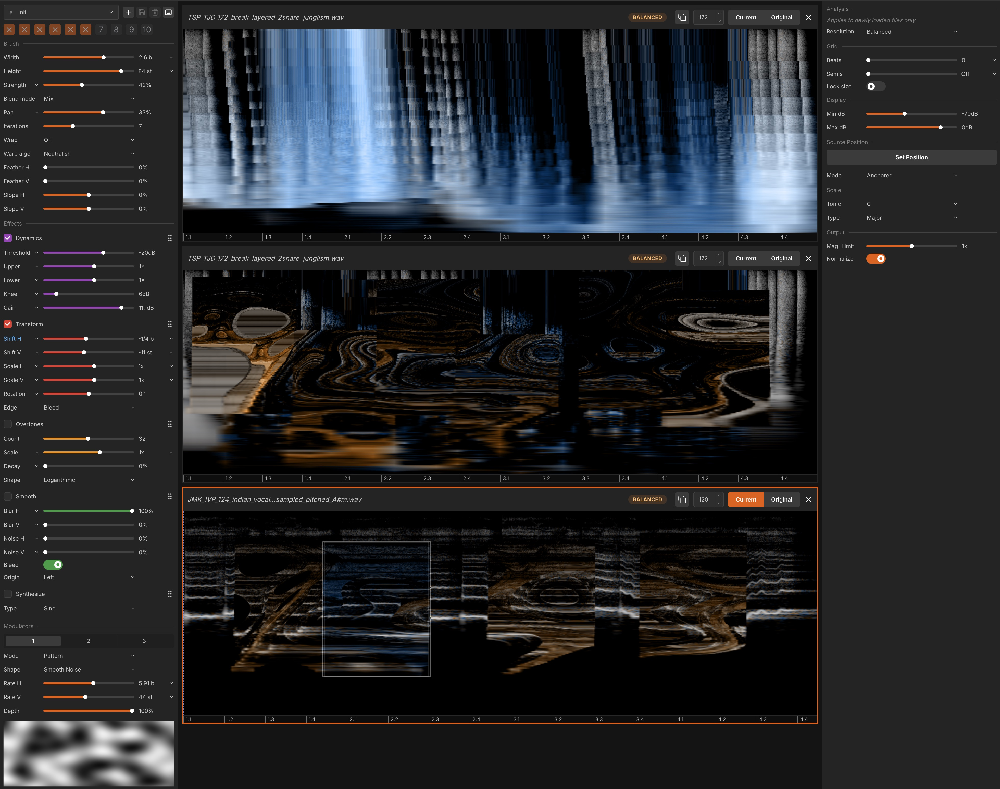

# Noise Canvas

Noise Canvas is a standalone tool for doing sound design that works a bit like Photoshop for audio.
It lets you load audio files, view them as **spectrograms**, and directly paint transformations and effects onto the sound.

The interface is built around **brushes**, **modulation**, **presets**, and a range of parameters that let you shape time, frequency, and stereo in real time.

Keep reading for a **beautiful** and **perfectly formatted** ChatGPT summary of me rambling for 10 minutes about Noise Canvas, full of **randomly bolded** words and **emdashes**.

Otherwise just open it up and play around. All the parameters have got tooltips. I'm of the belief that how to use a tool should be mostly obvious just by using it. If it's not then I need to fix something.



---

## Getting Started

Go to the **Releases** section on GitHub, and download the file for your platform.

Once installed, you can open audio files, paint effects directly onto their spectrograms, and hear the results instantly. It should be fairly intuitive.

### Important: Code Signing, Certificates, and “Scary” OS Warnings

Noise Canvas is **free software** — and that means I’m not paying for expensive signing certificates.

When software is “properly signed,” it’s linked to a digital certificate that tells your operating system _exactly who built it_.  
Those certificates cost money and for a free app, I'm just not going to do that soz.

So basically Noise Canvas is **unsigned**, which means your OS will complain the first time you open it.  
You’ll need to manually approve it once — after that, it’ll open normally.

#### On Windows

1. When you first open the installer or `.exe`, Windows will show a warning like:  
   “Windows protected your PC” or “Unknown publisher.”
2. Click **More Info**.
3. Then click **Run Anyway** or **Open Anyway**.

That’s it — the app will launch. Windows will remember your choice for next time.

#### On macOS

1. Try to open the app normally. macOS will block it and say it’s from an unidentified developer.
2. Go to **System Settings → Privacy & Security**.
3. Scroll down to the **Security** section.
4. You’ll see “Noise Canvas was blocked from opening” with an **Open Anyway** button. Click that.
5. macOS will ask again; confirm with **Open Anyway**.

After that, it’ll open fine forever.

If you trust me — great! If you don’t, I'm not exactly anonymous. If Noise Canvas does something dodgy you can trash me on instagram. Also the code is visible to all so you can see I'm not doing anything bad.

Eventually I might pay for a certificate and sign the binary properly, but for now you’ll just have to live with it if you want those sick spectral sounds. Sorry!

---

## Table of Contents

1. [Core Concepts](#core-concepts)
2. [Brushes and Effects](#brushes-and-effects)
   - [Shared Brush Parameters](#shared-brush-parameters)
   - [Parameter Controls and Shortcuts](#parameter-controls-and-shortcuts)
   - [Available Effects](#available-effects)
   - [Blend Modes](#blend-modes)
3. [Modulation](#modulation)
   - [How Modulation Amount Works](#how-modulation-amount-works)
   - [Modes](#modes)
   - [Modulator Inputs](#modulator-inputs)
   - [Modulator Controls](#modulator-controls)
4. [Presets and Quick Slots](#presets-and-quick-slots)
   - [Assigning Keys](#assigning-keys)
   - [Quick Slots](#quick-slots)
5. [Working with Multiple Files](#working-with-multiple-files)
6. [History](#history)
7. [Analysis and Display](#analysis-and-display)
   - [Source Position (Clone Stamp)](#source-position-clone-stamp)
8. [Output and Playback](#output-and-playback)
9. [File Menu](#file-menu)
10. [Integration with Ableton Live](#integration-with-ableton-live)
11. [Technical Overview](#technical-overview)
12. [Status](#status)
13. [Contributing](#contributing)
14. [Building](#building)
15. [Credits](#credits)
16. [License](#license)

---

## Core Concepts

At its heart, Noise Canvas is about **painting sound directly into a spectrogram**.

A spectrogram is a visual representation of sound where:

- The **horizontal axis** is **time** (measured in beats)
- The **vertical axis** is **pitch** (measured in semitones)
- The **brightness or color** represents **amplitude**

When you load an audio file, Noise Canvas analyzes it into this form using the **Constant-Q Transform (CQT)** — which gives a musically intuitive frequency layout.
Instead of abstract FFT bins, you’re working in **beats and notes**. That means everything you draw, erase, blur, shift, or distort corresponds directly to musical structure.

The workflow is simple:

1. Load a sound.
2. Pick an effect (or several).
3. Paint across time and pitch.
4. Hear the results instantly.

This approach makes sound design tangible — almost physical. You’re literally **painting timbre**.

You can load **multiple audio files** at once, and choose which one acts as the source (where data is pulled from) and which as the target (where data is painted to).
Undo, redo, and versioned saving let you experiment freely without fear of breaking anything.

---

## Brushes and Effects

Everything in Noise Canvas revolves around the brush — it’s the link between what you see and what you hear.

When you paint, the brush defines **where** and **how strongly** an effect is applied to the spectrogram.
Effects are modular: you can enable multiple ones at once, tweak them independently, and reorder them to change their processing order.

Each stroke applies transformations directly to the spectral data of the sound.

---

### Shared Brush Parameters

All brushes and effects share a set of core controls:

- **Strength** – how strongly the effect applies.
- **Iterations** – how many times the effect recursively applies (feedback loops, echoes, spectral delays, etc.).
- **Pan** – stereo positioning or left/right balance of processing.
- **Size ↔ (Time) / Size ↕ (Pitch)** – brush size in beats / semitones. At the minimum ("Grid") the brush tracks the grid spacing; at the maximum ("Full") it fills the whole file in that axis.
- **Curve ↔ / ↕** – shape of the brush envelope in each axis: −100% is a sharp spike, 0% a linear triangle, +100% a hard rectangle. This replaces the old "feathering" control — lower the curve for softer edges.
- **Skew ↔ / ↕** – where the envelope peak sits: for time, −100% is an early pluck, 0% centred, +100% a delayed hit; for pitch, −100% bottom, +100% top.
- **Wrap Mode** – behaviour when painting off the canvas edges: Off, Time, Pitch, or Time & Pitch.
- **Anchor Mode** – where the cursor sits on the brush: Corner (onset corner) or Center.
- **Blend Mode** – how the processed and original spectrogram are combined (see below).
- **Warp Algorithm** – resynthesis strategy for reconstructing sound after edits: **Neutral**, **Neutralish**, **Percussive**, **Flangey**, or **Noisey**. Each produces its own artifacts — pick what sounds best.

You can also assign up to **4 Macros** per brush — renamable controls that can drive any modulatable parameter at once.

---

### Parameter Controls and Shortcuts

Noise Canvas has a few useful shortcuts for working with sliders and parameters more efficiently.

#### Snapping to Preset Values

Many sliders have **preset values** — musically meaningful or commonly used settings (like specific beat divisions or semitone steps).  
When a slider supports presets, you’ll see a **small dropdown icon** next to its numeric value.

- **Click the dropdown icon** to open the full list of available preset values.
- **Hold Shift and drag** on the slider to **snap** between those preset values instead of moving smoothly.  
  This makes it easy to land precisely on useful values without fine-tuning manually.

#### Resetting Parameters

If you ever want to reset a parameter back to its default:

- **Double-click the label** of the parameter — it will instantly reset to its default value.

This works for almost all numeric parameters and makes experimentation less risky — if you make a mess, just double-click to go back.

---

### Available Effects

You can enable any combination of effects at once and change their order using the dots icon in the top-right corner of each panel. They're listed here in the order they appear in the UI.

Several effects share an **Edge Mode** that decides what happens to content that spills past the brush border: **Cut** (discard it), **Bleed** (pull in surrounding content), **Wrap** (wrap around the edge), **Clamp** (hold the edge value), **Reflect** (ping-pong flip), or **Invert**.

#### Dynamics

Controls amplitude, compression, expansion, gating, and inversion directly in the spectrogram domain.

- **Threshold** – amplitude threshold in dB.
- **Upper Ratio** – gain applied above the threshold (0.5 = compress, 2 = expand, 0 = gate, −1 = invert).
- **Lower Ratio** – gain applied below the threshold.
- **Knee** – smoothness of the transition around the threshold.
- **Gain** – overall output gain in dB.

#### Transform

Shifts, scales, and rotates the spectral image.

- **Shift ↔ / ↕** – move content in time (beats) or pitch (semitones).
- **Scale ↔ / ↕** – stretch or compress in time or pitch.
- **Rotation** – rotate the selection, in degrees.
- **Edge Mode** – behaviour at the brush borders (see above).

#### Overtones

Adds harmonic or inharmonic overtones to the painted region for richer timbres.

- **Count** – number of overtones (1–64).
- **Scale** – vertical spacing between overtones.
- **Decay** – how amplitude falls off per overtone.
- **Shape** – Logarithmic (natural harmonic series), Exponential, Octaves, or Selected Scale.

#### Blur

Smooths and blends frequencies over time and pitch for echo, reverb, and diffusion-like effects. (This was previously called "Smooth".)

- **Blur ↔ / ↕** – degree of blur in time / pitch.
- **Noise ↔ / ↕** – random scattering to make the blur more diffuse.
- **Samples ↔ / ↕** – blur kernel sample count (quality vs. speed).
- **Edge Mode** – behaviour at the brush border.
- **Origin** – where the blur radiates from: Left (forward reverb), Middle (symmetrical), Right (reversed).

#### Clone

Stamps beat- and semitone-spaced copies of the painted region in 2D — echoes, spectral delays, and stacked harmonics.

- **Space ↔ / ↕** – spacing between copies in beats / semitones (can be negative).
- **Copies ↔ / ↕** – number of copies along each axis (1–32).
- **Direction ↔ / ↕** – Forward/Middle/Backward and Up/Middle/Down.
- **Decay** – fade applied to each successive copy.
- **Edge Mode** – behaviour for copies extending past the border.

#### Synthesize

Fills the brushed area with generated material.

- **Type** – Noise, Sine, or Impulse.

#### Evolve

A reaction–advection–diffusion simulation for fluid, biological, and chaotic patterns.

- **Flow** – advection strength along the gradient (negative reverses).
- **Spread** – diffusion (positive spreads, negative sharpens).
- **Grow** – reaction strength (positive grows, negative shrinks).
- **Swirl** – adds a rotational component to the flow.
- **Drift ↔ / ↕** – directional bias in time / pitch.
- **Decay** – entropy / death rate (negative boosts).
- **Scale ↔ / ↕** – kernel size in time / pitch.
- **Edge Mode** – behaviour at the brush border.

#### Binaural

HRTF-based binaural spatialization for 3D placement of the painted region.

- **Azimuth** – horizontal angle (0° front, 90° right, −90° left, ±180° behind).
- **Distance** – source distance in metres (affects level and high-frequency absorption).
- **Stereo Angle** – stereo spread around the azimuth (0° = mono, 180° = full L/R offset).

#### Sort

Odd-even transposition sort of the spectrogram bins — pixel-sorting for sound.

- **Direction** – Horizontal, Vertical, or Both.
- **Order** – Forwards or Backwards.
- **Sort By** – Magnitude, Phase, dB, Frequency, or Pan.
- **Stereo Mode** – sort channels Linked or Independent.

#### Transmute

Low-level operations on the raw magnitude and phase of each bin.

- **Mode** – Swap Mag/Phase, Complex Power, Phase Rotate, Phase Quantize, Stereo Cross, or Phase Gate.
- **Amount** – the primary parameter for the selected mode.
- **Curve** – secondary shaping for modes that use it.

#### Waveshape

Waveshaper distortion applied to the spectral bins.

- **Shape** – Soft Clip, Hard Clip, Rectify, Fold, Wrap, or Sine.
- **Drive** – gain before shaping (for Fold/Wrap/Sine, controls how many times the signal cycles through the nonlinearity).
- **Tilt** – skews the real/imaginary balance before shaping.

#### Convolve

Time-axis convolution with an impulse-response spectrogram — reverbs, room tones, and other IR-based effects.

- **IR** – the impulse-response file, chosen from your open files.
- **Taps** – number of IR frames applied (longer, more expensive tail).
- **Start** – where in the IR the first tap begins.
- **Pitch Shift** – pitch shift applied to the IR, in semitones.
- **Rate** – source read rate per tap (1 = forward, −1 = reverse, other values stretch/compress the tail).
- **Gain** – output gain of the convolution, in dB.
- **Edge Mode** – behaviour for taps extending past the border.

---

### Blend Modes

How the processed data merges with the original spectrogram:

- **Mix** – normal crossfade.
- **Add** – adds the processed signal.
- **Subtract** – removes the processed values.
- **Multiply / Divide** – scale relationships.
- **Maximum / Minimum** – keep stronger or weaker values.
- **Difference** – absolute difference between source and result.
- **Dissolve** – noisy probabilistic mixing similar to Photoshop’s dissolve mode.
- **Screen** – Photoshop-style brightening (inverse multiply).
- **Mask** – a self-normalizing relative-energy gate.

---

## Modulation

Noise Canvas has a flexible modulation system for automating parameters in time and pitch.  
Anywhere you see a small dropdown icon on a parameter label, that parameter is modulatable. You can run up to **three modulators** at once.

### How Modulation Amount Works

This isn’t an “add some LFO on top” system. Think of it as **crossfading between the parameter’s slider value and a fully modulated value that is always clamped to the parameter’s legal range**.

- **Amount = 0%** → The parameter is **exactly** the value you set on its slider. No modulation is applied.
- **Amount = +100%** → The parameter ignores the slider and takes **pure modulation**, mapped from **that parameter’s minimum up to its maximum**. It **never** goes out of range.
- **Amount = −100%** → Same as +100% but **inverted**: the modulator is mapped from **maximum down to minimum**.
- **Amounts between −100% and +100%** blend between the slider value and the modulated value.

In other words, **Amount** controls “how much of the original slider value vs how much of the fully ranged modulation” you hear.

### Modes

Each modulator runs in one of three modes:

- **Pattern** – a 2D shape scrolled across time and pitch. Choose from waveforms (Sine, Triangle, Square, Sawtooth, Pulse, Random, Smooth Noise), a big set of procedural textures (Quilt, Clouds, Cells, Bubbles, Craters, Ripples, Scratches, Swirls, Paper, Marble, Weave, Terrain, Flow), or **Selected Scale** to snap modulation to the current scale.
- **Envelope** – follows the amplitude, phase, or panning of the painted region, with adjustable smoothing and dB range.
- **Sequencer** – a step grid with adjustable steps, rows, loop length, pitch range, and swing.

### Modulator Inputs

- **Factory shapes** – the built-in waveforms and procedural textures above.
- **User textures** – drop your own images in:

  ```
  Documents/Noise Canvas/Textures/
  ```

### Modulator Controls

- **Depth** – modulation intensity.
- **Rate ↔** – horizontal rate in beats.
- **Rate ↕** – vertical spacing in semitones.
- **Rotation** – rotates the pattern.
- **Stereo Spread** – decorrelates the left/right channels.
- **Phase ↔ / ↕** – offsets the pattern’s start position in each axis.

Beyond the three modulators, parameters can also be driven by **contextual sources** — Iteration, Time Position, Pitch Position, Randomize, Step, and pen Pressure / Tilt.

---

## Presets and Quick Slots

Noise Canvas supports a full **preset system** for saving and recalling configurations.

Presets are saved automatically in:

```
Documents/Noise Canvas/
```

### Assigning Keys

Next to the preset selector, click the **keyboard icon** to enable assignment mode.
Press any **A–Z key** to bind the current preset to that letter.
Later, pressing that key will instantly recall it.

### Quick Slots

The **number keys (1–0)** function as quick recall slots:

- Press or click a number to recall a saved slot.
- If it’s empty, the current settings will be saved to it.
- **Shift + click** or **Shift + number** deletes or overwrites the slot.

---

## Working with Multiple Files

You can open multiple files at once. They appear in a vertical list.

Each entry shows:

- **Copy** – duplicates the file.
- **BPM** – defines grid snapping resolution.
- **Current / Original Toggle** – determines source state:
  - **Current** – paints using the file’s current (edited) state.
  - **Original** – paints using the file’s unedited source.

This allows for layered processing, resampling, or selective restoration.

---

## History

Every edit you make is captured in the **History** panel — but it’s a **branching tree**, not a flat undo list. If you undo a few steps and then paint something new, the steps you undid aren’t thrown away: they stay as a separate branch you can return to at any time. This lets you explore variations freely without ever painting yourself into a corner.

Each entry is a snapshot of the file at that point. The **current** state is highlighted, and every node shows its label and how long ago it was made.

- **Jump to any state** – click a node to instantly return the file to it.
- **Undo / Redo** – the arrows at the top of the panel step to the parent node (undo) or the most recent child (redo). `Cmd/Ctrl+Z` and `Shift+Cmd/Ctrl+Z` do the same.
- **Rename** – double-click a node (or right-click → Rename) to give it a memorable name.
- **Favorite** – right-click → Favorite to star the states you like so they’re easy to find later.
- **Export a branch** – right-click → Export branch… renders out the audio for that node’s lineage. (In the Ableton extension there’s also **Export branch to Live**.)
- **Delete a branch** – right-click → Delete branch removes a node and everything downstream of it.

The panel’s **⋮ menu** adds **Export History**, **Export Favorites**, and **Purge History** — which clears the file’s on-disk history to reclaim space while leaving the current state untouched.

History is saved to disk alongside the file, so your whole tree survives closing and reopening.

---

## Analysis and Display

Right-hand panel settings:

- **Resolution** – trades off time vs. frequency detail, from **Best Time** through **Balanced** to **Best Pitch**.
- **Grid Size (Beats / Semitones)** – grid spacing for snapping; set the semitone grid to 0 to snap to the selected scale instead.
- **Grid Swing** – swing feel for the time grid.
- **Snap Time / Snap Pitch** – toggle snapping on each axis.
- **Minimum Frequency** – lowest frequency shown.
- **Scale** – tonic and scale type used for pitch snapping and scale-based effects/modulation.
- **Display Min / Max dB** – brightness range of the spectrogram.

### Splitting a File

Each file header has a **scissors** menu:

- **Split Harmonic and Percussive (HPSS)** – separates the file into harmonic and percussive layers.
- **Split Drums / Bass / Other / Vocals (AI)** – AI stem separation (macOS only; downloads a model on first use).

### Source Position (Clone Stamp)

Hold **Ctrl** and click to set a source position for painting from elsewhere in the file (or from another file).
Tracking modes:

- **Follow** – the source moves along with your stroke.
- **Fixed** – always samples from that position.
- **Anchored** – keeps a fixed offset relative to the source.

---

## Output and Playback

- **Mag. Limit** – soft-clips each bin’s magnitude to tame runaway peaks (0 = off).
- **Limiter** – bakes a true-peak limiter into the synthesized audio so playback and export don’t clip.
- **Accumulate** – when on, painting over the same area builds up; when off, a stroke won’t overlap itself.
- **Transport Controls** – play, loop, and auto-playback of strokes.
  When the paint icon is active, each stroke automatically plays back the affected region.

---

## File Menu

**File:**

- **New** – create an empty file (set sample rate, BPM, length in beats).
- **Open / Open Recent** – load existing audio.
- **Save / Save As** – save the current file.
- **Save Version** – save a numbered copy without overwriting the original.
- **Close File** – close the current tab.
- **Export History** – export the file’s edit history.

**Edit:**

- **Undo / Redo** – full edit history.
- **Restore Original** – reload the unedited file.
- **Re-analyze File** – regenerate the analysis at the current resolution settings.
- **Duplicate File** – duplicate the active file.
- **Double Length / Half Length** – stretch or shrink the file’s length.

---

## Integration with Ableton Live

Noise Canvas integrates seamlessly with Ableton Live.

1. In **Live Preferences → File/Folder**, set **Noise Canvas** as your _External Sample Editor_.
2. In Live, right-click a sample and select **Edit**.
3. The sample opens in Noise Canvas.
4. Make your edits.
5. Save and close.
6. Live automatically reloads the updated version.

No exporting, importing, or manual refreshing required.

---

## Technical Overview

- Built with **Electron**, **TypeScript**, and **React**
- Uses **React Three Fiber** for rendering
- GPU-accelerated DSP written in **GLSL shaders**
- Spectrogram analysis powered by **Gaborator** using the Constant-Q Transform

The Constant-Q Transform (CQT) adjusts time resolution based on frequency:

- Low frequencies → lower time resolution (smeared in time, accurate in pitch)
- High frequencies → higher time resolution (precise in time, less in pitch)

This matches human hearing and avoids the artificial “FFT sound,” producing more natural transients and harmonics.

---

## Status

Noise Canvas is still in development.
Stability is not guaranteed, but issues will be tracked and fixed when I can be arsed.

Current tasks, bugs, and ideas live here:
[https://trello.com/b/P2vcaaZI/noise-canvas](https://trello.com/b/P2vcaaZI/noise-canvas)

---

## Contributing

Contributions are welcome with caveats.
If you want to add features or improvements, reach out first so we can align on direction.
You’re also free to fork it and take it your own way — but on the main fork, I’ll have final say.

---

## Building

### macOS / Linux

```bash
git clone <repo>
cd noise-canvas
npm i
```

### Windows

Install Node.js and make sure **native build tools** are included.
Then open _Visual Studio Installer_ and ensure **Windows 11 SDK** is selected under Build Tools.

Finally:

```bash
npm i
```

That should work. Probably. God I hate Windows.

---

## Credits

- [3dtextures.me](https://3dtextures.me/) – for the textures
- [Gaborator](https://gaborator.com/) – for spectral analysis
- Tomas Boroski – for the amazing icon ([github](https://github.com/tomasborosko), [instagram](http://instagram.com/fivesteppath))

---

## License

Noise Canvas uses the GNU Affero General Public License v3 (AGPL-3.0).
See [LICENSE.md](./LICENSE.md) for the full text.

This program is free software: you can redistribute it and/or modify it
under the terms of the GNU Affero General Public License as published by
the Free Software Foundation, either version 3 of the License, or
(at your option) any later version.

This program is distributed in the hope that it will be useful,
but without any warranty; without even the implied warranty of
merchantability or fitness for a particular purpose.

In short:
You can use, study, share, and modify this software freely.
If you distribute it or run it publicly, you must share your source under the same license.

**© 2025 Rob Clouth**
