# Noise Canvas Manual

The complete guide to Noise Canvas. For downloads, installation, and build instructions, see the [README](../README.md).

Every control has a tooltip and an entry in the `?` overlay.

## Contents

1. [First Steps](#first-steps)
   - [1. Open a Sound](#1-open-a-sound)
   - [2. Choose a Brush](#2-choose-a-brush)
   - [3. Aim the Brush](#3-aim-the-brush)
   - [4. Paint a Stroke](#4-paint-a-stroke)
   - [5. Listen, Undo, Save](#5-listen-undo-save)
2. [Core Concepts](#core-concepts)
   - [Why Constant-Q](#why-constant-q)
   - [Analysis Resolution](#analysis-resolution)
   - [Scales](#scales)
3. [The Interface](#the-interface)
4. [Brushes](#brushes)
   - [The Palette](#the-palette)
   - [The Brush List](#the-brush-list)
   - [Steps](#steps)
   - [Macros](#macros)
   - [Source](#source)
   - [Envelope](#envelope)
   - [Options](#options)
   - [Warp Algorithms](#warp-algorithms)
   - [Blend Modes](#blend-modes)
5. [Effects](#effects)
   - [Dynamics](#dynamics) · [Transform](#transform) · [Blur](#blur) · [Repeat](#repeat) · [Synthesise](#synthesise) · [Evolve](#evolve) · [Binaural](#binaural) · [Sort](#sort) · [Transmute](#transmute) · [Convolve](#convolve) · [Attract](#attract)
6. [Modulation](#modulation)
   - [How Modulation Amount Works](#how-modulation-amount-works)
   - [Modulator Modes](#modulator-modes)
   - [Pattern Shapes and Images](#pattern-shapes-and-images)
   - [Modulator Controls](#modulator-controls)
   - [The Sequencer Grid](#the-sequencer-grid)
   - [Contextual Sources](#contextual-sources)
   - [Nested Modulation](#nested-modulation)
7. [Fill Grid](#fill-grid)
8. [Parameter Controls](#parameter-controls)
   - [Section Presets](#section-presets)
   - [Randomisation](#randomisation)
   - [Linking Parameters Across Steps](#linking-parameters-across-steps)
9. [Working with Files](#working-with-files)
   - [Mono and Stereo](#mono-and-stereo)
   - [Splitting a File](#splitting-a-file)
   - [Stem Groups](#stem-groups)
   - [Onsets](#onsets)
   - [The Level Strip](#the-level-strip)
   - [Navigating the Canvas](#navigating-the-canvas)
10. [History](#history)
11. [Transport and Output](#transport-and-output)
12. [Menus](#menus)
13. [Keyboard Shortcuts](#keyboard-shortcuts)
14. [Getting Help](#getting-help)
15. [Where Things Are Saved](#where-things-are-saved)
16. [Working with Ableton Live](#working-with-ableton-live)

---

## First Steps

The first launch offers a walkthrough. It opens a demo loop, has you build a brush and paint with it, and takes about a minute. **Help → Run Walkthrough** replays it whenever you want it.

### 1. Open a Sound

**File → Open** (`Cmd/Ctrl+O`), or drag an audio file onto the window. It is analysed and drawn as a spectrogram in the middle area: beats across, semitones up, brightness for loudness, orange and blue for the stereo image.

Set **BPM** in the file header to the tempo of the audio. A file opens at the last tempo you used, or 120, and every beat-based size, offset and grid line is measured from it.

Press `Space` to hear the file. Click along the time legend under it to move the start position, or drag along the legend to loop a region.

### 2. Choose a Brush

A brush is a stack of effects plus the envelope that places them. A fresh install has one empty palette holding one empty brush, and a brush with no effects does nothing to the sound, so start from the ones that ship with the app:

1. Click **Add palette** at the bottom of the sidebar.
2. Pick one of the palettes that come with the app. Each is a set of brushes for one kind of job, and its name says which.
3. Click a brush in it to make it active. The number keys `1`–`9` and `0` reach the top palette's brushes.

Hover a brush row to see the effects inside it, and the [brush panel](#brushes) down the left edge to see them laid out in full. Try a few on anything, and a drum loop on the rhythmic ones.

### 3. Aim the Brush

Move the pointer over the spectrogram. The rectangle that follows it is the brush, and what it covers is what the next stroke changes. It is sized in the [Envelope](#envelope) section:

- **Size ↔** in beats and **Size ↕** in semitones. At **Full**, the brush covers the whole file in that axis.
- **Strength** at 100% applies the effect at full force, and lower values blend the stroke into what is already there.

The brush snaps to the grid as it moves. **Beats** and **Semis** in the transport bar space that grid, and the **Snap** switch beside each turns it off for free positioning.

### 4. Paint a Stroke

**Drag with the left mouse button** across the spectrogram. A single click lays down one brush-sized stamp instead. Either one is a **stroke**: the picture follows the pointer as you go, and the audio is rebuilt when you let go.

The arrow keys move the brush one grid cell at a time and `Enter` applies it where it stands, which is the way to place strokes exactly rather than by hand.

### 5. Listen, Undo, Save

- **Auto-play stroke**, the brush icon in the transport bar, plays each stroke back as soon as you finish it. It is off until you switch it on.
- `Cmd/Ctrl+Z` undoes. Every state is kept in the [History](#history) panel as a branching tree, so undoing a few strokes and painting something else keeps both.
- **Save** (`Cmd/Ctrl+S`) writes back over the original audio file. **Save Version** (`Cmd/Ctrl+Alt+S`) writes a numbered copy alongside it and leaves the original where it is.

From here: build a brush of your own with **Add brush → New** and **Add effect**, make one move across a stroke with [Modulation](#modulation), paint from a second file with [Source](#source), or skip painting altogether and lay the brush on every cell of the grid at once with [Fill Grid](#fill-grid).

**Hints**

- If strokes land in the wrong place, check the file's BPM before you touch the brush.
- Drop **Strength** to around 30% and paint the same area two or three times, and you can hear the effect arrive rather than land all at once.

---

## Core Concepts

Noise Canvas is about painting sound directly into a spectrogram, a picture of sound where:

- The **horizontal axis** is **time**, measured in beats.
- The **vertical axis** is **pitch**, measured in semitones.
- The **brightness** is **amplitude**, and the **colour** is the stereo image: orange leans left, blue leans right, grey is equal in both.

When you load an audio file, Noise Canvas analyses it into this form with the **Constant-Q Transform (CQT)**, which lays frequency out the way music does. You work in beats and notes, so everything you draw, erase, blur, shift or distort lines up with musical structure.

The workflow is:

1. Load a sound.
2. Build a brush out of one or more effects.
3. Paint across time and pitch.
4. Hear the results at once.

You can load several audio files at once and choose which one acts as the source, where data is read from, and which as the target, where data is painted. A branching history and versioned saving let you experiment without losing anything.

### Why Constant-Q

The Constant-Q Transform adjusts time resolution with frequency:

- Low frequencies get lower time resolution: smeared in time, accurate in pitch.
- High frequencies get higher time resolution: precise in time, less so in pitch.

This matches how hearing works, so transients and harmonics come out closer to natural than a fixed-window analysis manages.

### Analysis Resolution

Where a file sits on that trade-off is set when it is analysed, and shown as a badge in its header. The badge is a menu: pick a resolution from it and the file is analysed again at once.

| Badge            | What it does                                                                                 |
| ---------------- | -------------------------------------------------------------------------------------------- |
| **Best Time**    | Sharpest transients, coarsest pitch. Drums, percussive edits, anything where attacks matter. |
| **Better Time**  | Leans towards time, and still separates notes usefully.                                      |
| **Balanced**     | The default. Handles pitched material and transients without favouring either.               |
| **Better Pitch** | Leans towards pitch, at some cost to attacks.                                                |
| **Best Pitch**   | Finest pitch separation, softest transients. Pads, drones, harmonic work.                    |

The choice changes what edits sound like, not just how the spectrogram looks: a shift or a stretch is rebuilt from these bands, so a file analysed with **Best Time** keeps its clicks crisp while one with **Best Pitch** keeps its harmonics clean.

Files run to a little over five minutes at 44.1 kHz, and less at higher sample rates or with several files already open.

### Scales

One scale is set for the whole app, from **Tonic** and **Type** in the transport bar. Everything below that says "the selected scale" means this one.

- **Tonic** is the root note, and **Type** is the scale pattern built on it.
- The scale is global, not per file, so changing it changes every file and every brush at once.

The scale reaches six places:

| Where                                 | What it does                                                                                                             |
| ------------------------------------- | ------------------------------------------------------------------------------------------------------------------------ |
| **Pitch snapping**                    | Set the pitch grid (**Semis**) to **Scale** and turn **Snap Pitch** on, and strokes land on in-scale notes only.         |
| **The scale grid**                    | With the pitch grid on **Scale**, the canvas draws a line at every in-scale note, as long as there is room to show them. |
| **Transform → Shift ↕**              | Snaps its shift to scale notes, so a transposed copy stays in key. Needs pitch snapping on.                              |
| **Repeat → Shape ↕: Scale**          | Spaces the copies by scale degrees instead of by a fixed interval.                                                       |
| **Modulator → Shape: Selected Scale** | Steps the modulator's field by scale notes.                                                                              |
| **Attract → Map: Scale**              | Puts a valley on every note of the scale, so smear is pulled onto it.                                                    |

---

## The Interface

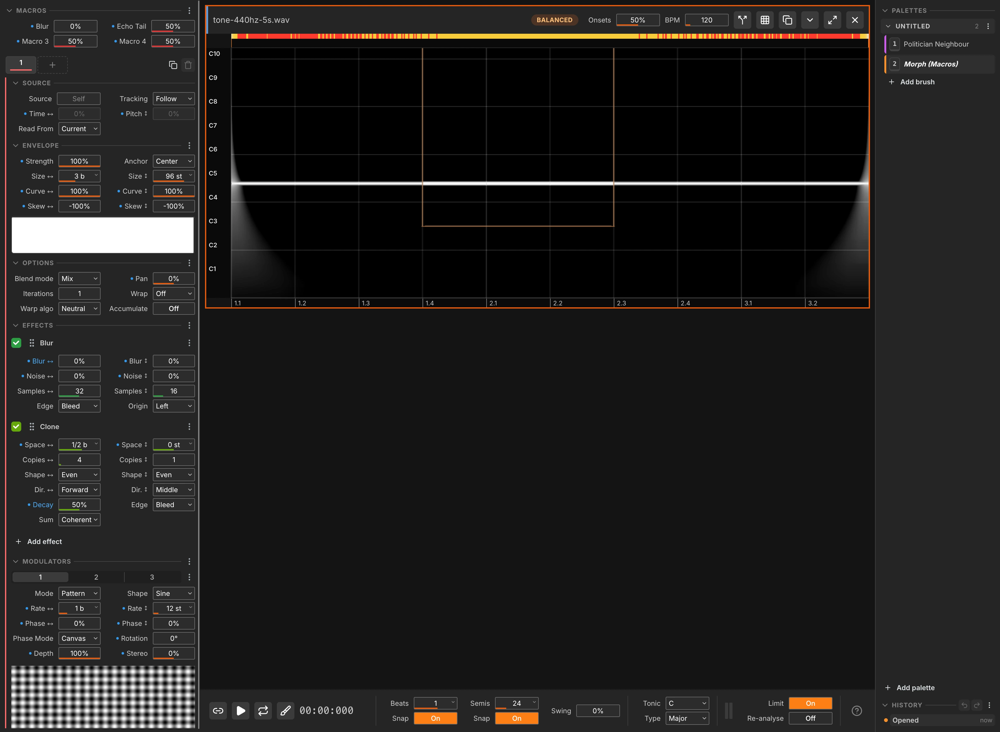

The window is three columns, with a menu bar above and a transport bar below:

- **Top: Menu bar.** File, Edit, View and Help, with the memory reading and the **?** button at the right-hand end.
- **Left: Brush panel.** Everything that defines the current brush: Macros, Steps, Source, Envelope, Options, Effects, Modulators.
- **Middle: Canvas.** Every open file stacked vertically, each with its own header, time legend and pitch legend. Minimised files collapse into the dock at the bottom.
- **Right: Sidebar.** The open palettes and their brushes on top, the history tree below.
- **Bottom: Transport.** Playback, grid, scale, meters, stroke limiting, Ableton Link.

**Compact UI** (`Cmd/Ctrl+Shift+C`, or **View → Compact UI**) shrinks every control so more fits on smaller screens.

---

## Brushes

The brush is the link between what you see and what you hear. When you paint, it decides **where** and **how strongly** an effect is applied to the spectrogram. Effects are modular: run several at once, set each independently, and reorder them to change the order they process in.

### The Palette

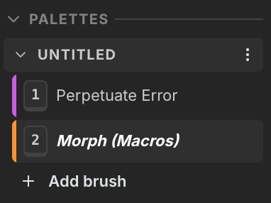

A palette is a folder of brushes for one job. The sidebar shows each open palette as a grey band with its brushes indented under it, and you can have as many open at once as you like.

- **Click a band** to fold its brushes away.
- **Drag a band** up or down to reorder the palettes. The top palette is the one the number keys reach.
- **Drag** a brush from one palette to another to move it between them. Dropping it on a band sends it to the top of that palette, which is how you reach a folded one.
- The band's **⋮** offers Save, Save as…, Rename, Close and Delete file….
- **Add palette** at the bottom of the sidebar opens the browser: **New** for an empty palette, or any saved one below it.

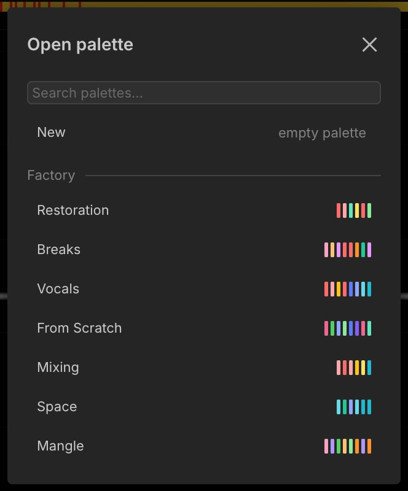

- **Add brush** sits at the end of each palette's own list, so a new brush lands where you asked for it.
- A band shows its name in _italics_ until its brushes match a saved file, so a palette you have never saved stays italic. Closing one asks first, and counts the brushes that go with it.
- The last open palette cannot be closed, so there is always somewhere for a new brush to go.

Palettes are JSON in `Documents/Noise Canvas/Palettes/`, beside the `Presets/` folder single brushes save to. Opening one makes a fresh copy, so the same palette can be open twice and edits do not reach the file until you Save.

A brush can sit in several palettes. The picker shows which ones under each brush's name.

### The Brush List

Brushes live inside a palette. Each is an independent set of steps, effects, modulators and macros, and you can have as many open as you like. **Add brush** puts a new one in the palette holding the brush you have selected.

- A **colour bar** down the left edge identifies each brush, and the same colour marks it wherever it is referenced. ⋮ → _Colour_ opens a grid of every hue, one shade to a row.
- **Hover** a row to see what is in it: each step's effects, in order.
- **Click** a row to make it active.
- The **⋮ menu** offers Rename, Colour, Duplicate, Save, Save as…, Load referenced files, Assign key…, Remove key, and Close.
- **Drag** rows to reorder them, or to move a brush into another palette.
- **Add brush** at the end of each palette opens the picker: **New** for an empty brush, or any preset below it.

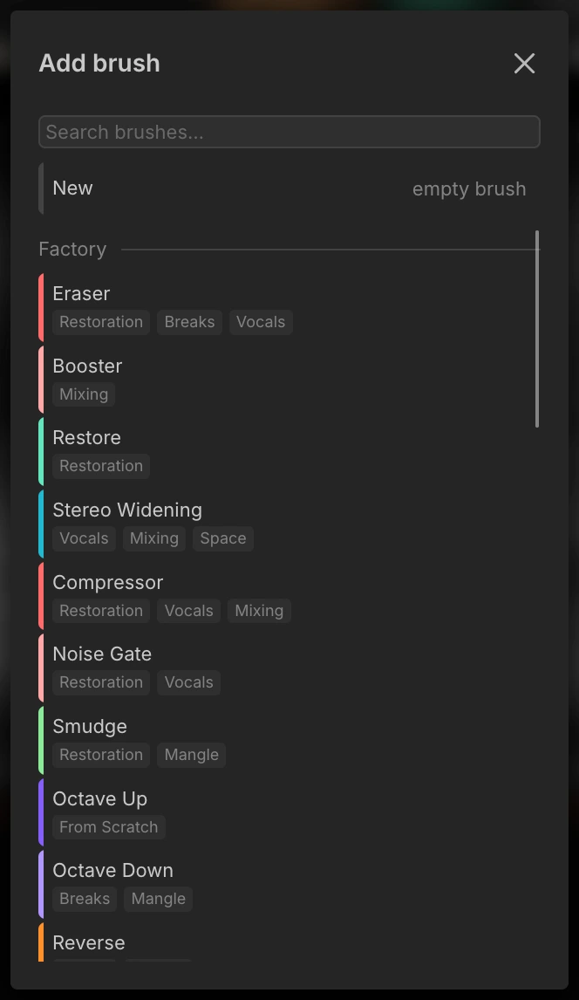

**Hotkeys.** Any brush can be bound to a letter key (⋮ → _Assign key…_, then press a letter). Pressing that letter anywhere in the app jumps to that brush. The number keys **1–9 and 0** select the first ten brushes of the **top palette**, so dragging a palette to the top puts its brushes under your fingers.

**The library.** Brushes are saved as JSON presets in `Documents/Noise Canvas/Presets/`. A brush loaded from the library remembers where it came from: _Save_ overwrites it, _Save as…_ creates a new one, and its name sits in italics until it matches a saved preset, so a brush you have never saved stays italic. This is the level below the palette, one brush to a file, where a palette is a whole set.

### Steps


A brush can have up to **5 steps**, shown as a tab strip. Each step is a complete, independent set of brush parameters and effects, and a single stroke runs through **all** of them in order. This is how you build multi-stage moves: step 1 synthesises a tone, step 2 blurs it, step 3 places it in space.

- **Drag** to reorder, **Duplicate** and **Delete** from the buttons on the right.
- The strip is fixed-width, so adding or removing a step never rescales the others.
- Switching tabs switches the whole brush panel. To hold one value the same in every step, link it from its label menu. See [Linking Parameters Across Steps](#linking-parameters-across-steps).

### Macros

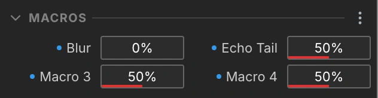

Four renamable **Macros** per brush. A macro is a knob that can drive any modulatable parameter, at any depth, positive or negative. Rename one from its parameter label menu (the pencil icon).

A macro that drives one parameter shows that parameter's value in place of a percentage, so **Speed** reads `2×` rather than `60%`. With several targets it shows a percentage, and its tooltip lists each target with the value it sits at. A macro with nothing wired to it is greyed out.

**Hints**

- Wire several parameters to one macro to collapse a complicated brush into a single performance control.

### Source

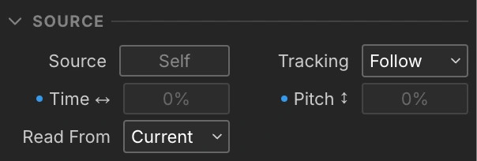

By default a brush reads from the file it is painting on. The **Source** section changes that. This is the clone stamp.

- **Source** – hold **Shift**, or click the Source control to arm it, then click any open file's canvas to pick a source file and position. A brush-sized rectangle previews where you are sampling from.
- **Tracking** – how the source position is used. See the table below.
- **Time ↔ / Pitch ↕** – the source position, as a percentage of the source file. Disabled in Follow mode, and both are modulatable.
- **Read From** – **Current** paints from the source file's edited state, **Original** paints from its unedited analysis.

| Tracking     | What it does                                        |
| ------------ | --------------------------------------------------- |
| **Follow**   | The source moves along with your stroke.            |
| **Fixed**    | Always samples that exact position.                 |
| **Anchored** | Keeps a fixed offset from where the stroke started. |

Source and destination do not have to match. They can differ in tempo, length and analysis resolution, and positions are mapped so that frequencies line up.

**Hints**

- Set **Read From** to **Original** and painting becomes a local undo: the region you paint comes back and nothing else moves. This is all the Restore brush is.

### Envelope

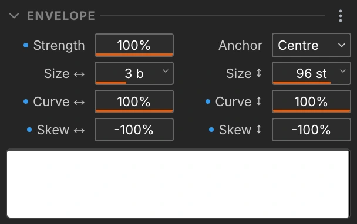

The brush envelope decides where the stroke deposits energy and how much.

- **Strength** – how strongly the effect applies. Lower it to blend a stroke in rather than replace what is there.
- **Anchor** – where the cursor sits on the brush. **Corner** puts it on the bottom-left corner, on the onset. **Centre** puts it on the brush centre, on the envelope peak.
- **Size ↔ (beats) / Size ↕ (semitones)** – the size of the brush. At the minimum, **Grid**, the brush tracks the current grid spacing. At the maximum, **Full**, it fills the whole file in that axis and anchors to the edge.
- **Curve ↔ / ↕** – the shape of the envelope in each axis. −100% is a sharp spike, 0% a linear triangle, +100% a hard rectangle.
- **Skew ↔ / ↕** – where the envelope peak sits. In time, −100% is an early pluck, 0% is centred, +100% is a delayed hit. In pitch, −100% is the bottom and +100% the top. Contextual Time or Pitch modulation flattens the envelope rather than moving its peak.
- **Shapes** – a row of tiles under the controls, each setting Curve ↔ / ↕ and Skew ↔ / ↕ in one click: a hard box, softened edges in both axes or in one, and a fade in or out in either axis.

**Hints**

- Set Anchor to **Corner** for rhythmic strokes, so snapping locks hits to the grid, and to **Centre** for pads, so snapping puts the envelope peak on the grid.
- Modulate **Skew ↔** with a pattern slower than the brush for a peak that slides from stroke to stroke.

### Options

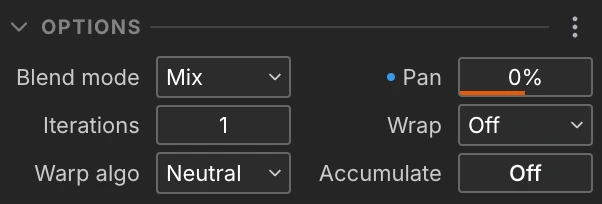

- **Blend Mode** – how the processed and original spectrogram are combined. See [Blend Modes](#blend-modes).
- **Pan** – stereo position of the processed result.
- **Iterations** – how many times the effect chain re-runs inside one stroke, feeding each pass back in.
- **Wrap** – what a stroke does when it runs off an edge: Off, Time, Pitch, or Time & Pitch.
- **Warp Algo.** – how sound is rebuilt when it moves. See [Warp Algorithms](#warp-algorithms).
- **Accumulate** – on, painting over the same area builds up, and holding the mouse still keeps it building until you let go. Off, a single stroke will not overlap itself, so dragging back and forth does not double-apply.

**Hints**

- Two or three iterations turn one effect into echoes and spectral delays.

### Warp Algorithms

Moving sound in time or pitch means rebuilding it, and each option colours the result differently. The picker splits them in two: the **Natural** pair rebuilds the sound as it was, and the **Coloured** three rebuild it into something else. Pick by ear:

| Algorithm   | Group    | Sounds like                                                | Reach for it on                                          |
| ----------- | -------- | ---------------------------------------------------------- | -------------------------------------------------------- |
| **Sharp**   | Natural  | Clean and faithful. Attacks stay sharp, notes stay steady. | Anything. This is the default, and it holds up on drums. |
| **Soft**    | Natural  | Faithful with a slightly softer edge.                      | Sustained material that Sharp makes sound too tight.     |
| **Locked**  | Coloured | Hard and robotic, pinned to the spot you paint into.       | Bending a move into a machine-like rhythm.               |
| **Flangey** | Coloured | Hollow and metallic, like a comb filter.                   | Adding a phasey, robotic character on purpose.           |
| **Noisey**  | Coloured | Diffuse and breathy, edges blurred away.                   | Pads, textures, and turning a sound into a wash.         |

### Blend Modes

How the processed data merges with the original spectrogram:

| Mode                  | What it does                                                        |
| --------------------- | ------------------------------------------------------------------- |
| **Mix**               | Crossfades between the two.                                         |
| **Add**               | Adds the processed signal on top.                                   |
| **Subtract**          | Removes the processed values.                                       |
| **Multiply / Divide** | Scales one by the other.                                            |
| **Maximum / Minimum** | Keeps whichever value is stronger, or weaker.                       |
| **Difference**        | Takes the absolute difference between the two.                      |
| **Dissolve**          | Mixes at random, pixel by pixel.                                    |
| **Mask**              | Keeps the original only where the processed result also has energy. |
| **Screen**            | Brightens, as an inverse multiply.                                  |

---

## Effects

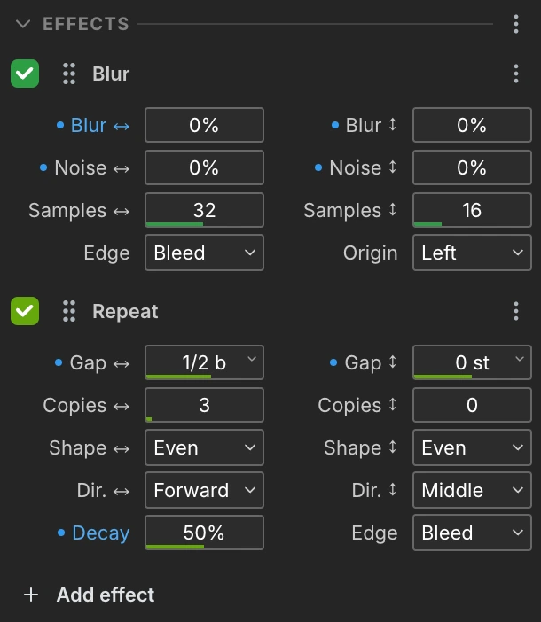

Add effects with **Add effect** at the bottom of the Effects section. The picker lays them out in two columns with a description for each. A step holds **up to 10 effects**, and you can add several instances of the same effect, each with its own settings.

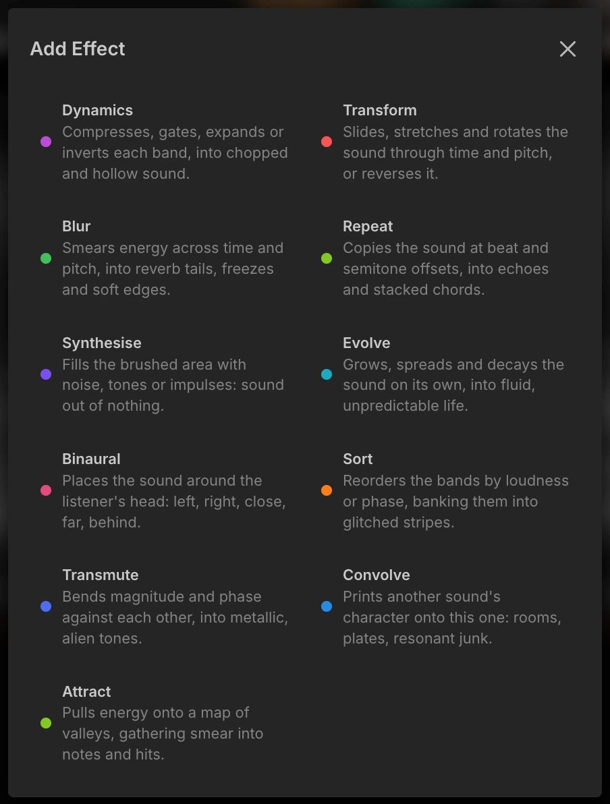

Each effect header has a **checkbox** that bypasses it, a **title that doubles as the drag handle** for reordering, and a **⋮ menu** with Duplicate, Reset to defaults, and Remove.

Several effects share an **Edge** control, which decides what happens to content that spills past the brush border:

| Mode        | What it does                         |
| ----------- | ------------------------------------ |
| **Cut**     | Discards it.                         |
| **Bleed**   | Pulls in the surrounding content.    |
| **Wrap**    | Brings it back round the other side. |
| **Clamp**   | Holds the value at the edge.         |
| **Reflect** | Flips it back in.                    |
| **Invert**  | Flips it back in upside down.        |

### Dynamics

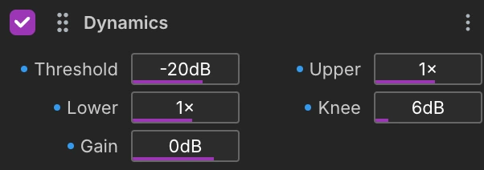

Compresses, gates, expands or inverts what the brush covers. It works on each band separately rather than on the sound as a whole, so it can pull the hiss out from between notes and leave the notes alone.

- **Threshold** – the level that splits loud from quiet, in dB.
- **Upper** – what happens above the threshold. See the table below.
- **Lower** – the same, applied below the threshold.
- **Knee** – the width of the transition around the threshold, in dB.
- **Gain** – output gain, in dB.

| Ratio    | What it does     |
| -------- | ---------------- |
| **1×**   | Leaves it alone. |
| **0.5×** | Compresses it.   |
| **2×**   | Expands it.      |
| **0×**   | Gates it out.    |
| **−1×**  | Inverts it.      |

**Hints**

- Take **Gain** all the way down and Dynamics becomes an eraser.
- **Upper** at −1× keeps what was quiet and drops what was loud, turning a sound inside out.

### Transform

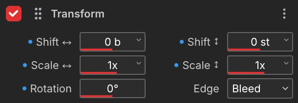

Slides, stretches and rotates sound through time and pitch, or reverses it. How it sounds afterwards depends a great deal on the [warp algorithm](#warp-algorithms) in Options.

- **Shift ↔ / ↕** – moves content in time (beats) or pitch (semitones). Shift ↕ snaps to the selected scale when the pitch grid is set to Scale. See [Scales](#scales).
- **Scale ↔ / ↕** – stretches or squashes in time or pitch. Negative values reverse or mirror.
- **Speed** – plays the region faster or slower, moving pitch and length together. It multiplies whatever Scale ↔ and Shift ↕ already do.
- **Origin ↔ / ↕** – the point a Scale or a Rotation turns around. A negative Scale still mirrors inside the brush wherever the origin sits.
- **Rotation** – turns the painted region, in degrees.
- **Edge** – what happens at the brush borders.

**Hints**

- Shift ↕ and Scale ↔ are independent, so a stretch alone does not move the pitch. Speed is the tape version, where both move at once.
- **Edit → Double Length** first, then **Scale ↔** to 2, and the stretch has somewhere to go.

### Blur

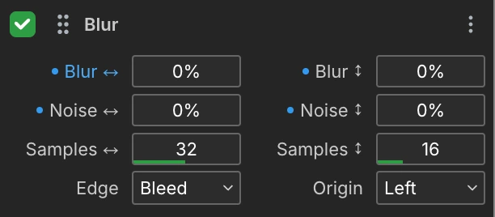

Smears energy across time and pitch, into reverb tails, freezes and soft edges.

- **Blur ↔ / ↕** – how far the smear reaches in time and in pitch.
- **Noise ↔ / ↕** – scatters each tap, roughening the smear.
- **Samples ↔ / ↕** – how many taps each axis takes, trading speed for smoothness.
- **Edge** – what the blur reads past the brush border.
- **Origin** – which side the smear runs from. See the table below.

| Origin     | What it does                         |
| ---------- | ------------------------------------ |
| **Left**   | Trails forwards, like reverb.        |
| **Middle** | Spreads both ways at once.           |
| **Right**  | Runs backwards, like reverse reverb. |

**Hints**

- Paint past the end of a sound. The tail needs somewhere to go.
- A wide brush with **Blur ↔** high smears everything under it into one sustained wash.

### Repeat

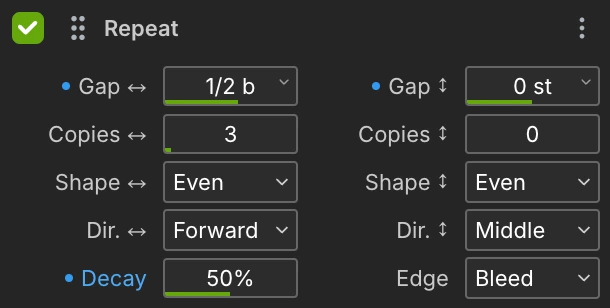

Copies the painted region at beat and semitone offsets, into echoes, spectral delays and stacked harmonies.

- **Gap ↔ / ↕** – the spacing between copies, in beats and semitones. Can be negative. With any shape other than Even this is the gap to the _first_ copy, and the shape sets the rest.
- **Copies ↔ / ↕** – how many copies each axis adds on top of the original, up to 63. 0 leaves that axis alone.
- **Shape ↔ / ↕** – how the gaps grow from copy to copy. See the table below.
- **Dir. ↔ / ↕** – Forward, Middle or Backward, and Up, Middle or Down.
- **Decay** – the fade applied to each successive copy. The two axes multiply, so 50% puts the outermost copy 30 dB down and 100% mutes every copy past the first.
- **Edge** – what happens to copies that reach past the border.

Overlapping copies add as waves, so a tight stack can interfere and comb.

#### Shapes

Every shape places the first copy one **Gap** value out, so switching shape never moves it. Only the copies past it move.

| Shape ↕   | Shape ↔     | Gaps                                                                             |
| ---------- | ------------ | -------------------------------------------------------------------------------- |
| Even       | Even         | All the same. Gap ↕ at 12 gives octaves, 7 gives fifths.                        |
| Harmonic   | Decelerating | The natural harmonic series. Gaps shrink as they climb.                          |
| Geometric  | Accelerating | Every gap is twice the one before.                                               |
| Inharmonic | Uneven       | The harmonic series stretched sharp, like a struck bar or a piano's top octaves. |
| Scale      | n/a          | Even steps, with every copy snapped to the nearest note of the selected scale.   |

Even is the only shape with even gaps, and the only one a modulator can reach. Modulation stretches the whole comb at once, so it cannot make gaps unequal. That is what the shapes are for.

**Hints**

- Set **Copies ↔** to 0, **Shape ↕** to Harmonic and **Gap ↕** to 12, and Repeat stacks a harmonic series on whatever it covers. Above 12 the partials spread sharp, below 12 they compress.
- **Shape ↕** on Scale with **Gap ↕** at 3 or 4 stacks thirds that stay in key.

### Synthesise


Fills the brushed area with sound out of nothing, so you can draw parts that were never recorded.

- **Type** – Noise, Sine, or Impulse.

Everything else about the sound comes from the envelope: **Size ↔** and **Curve ↔** shape a hit, **Size ↕** places it in the spectrum.

**Hints**

- Turn pitch snapping on and Sine draws a line that stays in key.

### Evolve

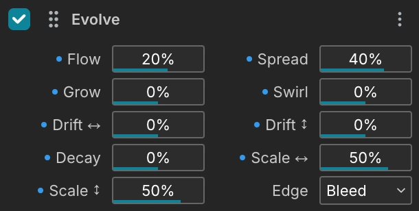

Grows, spreads and decays the sound on its own, into fluid, biological or chaotic textures. It is the least predictable effect here, and rewards small values.

- **Flow** – how strongly energy travels, and which way. Negative reverses the current.
- **Spread** – positive spreads energy out, negative sharpens it.
- **Grow** – positive grows the sound, negative eats it away.
- **Swirl** – adds a rotation to the flow.
- **Drift ↔ / ↕** – pushes the movement in a direction, in time and in pitch.
- **Decay** – how fast it dies away. Negative feeds it instead.
- **Scale ↔ / ↕** – how far each step reaches, in time and in pitch.
- **Edge** – what Evolve reads past the brush border.

**Hints**

- Evolve runs one step per pass, so **Iterations** in Options is what decides how far it gets. Small values and many passes beat large values and one.

### Binaural

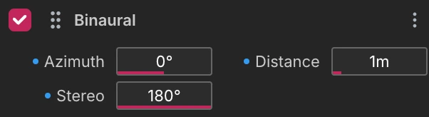

Places the painted sound anywhere around the listener's head, in 3D. It is made for headphones. On speakers you mostly hear it as width.

- **Azimuth** – the horizontal angle: 0° is front, 90° right, −90° left, ±180° behind.
- **Distance** – how far away the sound is, in metres. Distance drops the level and rolls off the top end.
- **Stereo** – the spread around the azimuth. 0° is a point, 180° puts the channels ±90° either side.

**Hints**

- Modulate **Azimuth** with a slow pattern to orbit a sound around the head.

### Sort

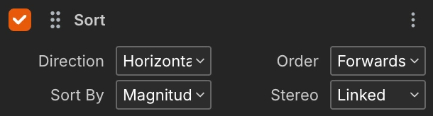

Reorders the bands inside the brush, so loud content collects at one edge and the rest banks up behind it. It reads as stripes, bands and digital smear.

- **Direction** – Horizontal, Vertical, or Both.
- **Order** – Forwards or Backwards.
- **Sort By** – Magnitude, Phase, dB, Frequency, or Pan.
- **Stereo** – sorts the channels Linked or Independent.

### Transmute

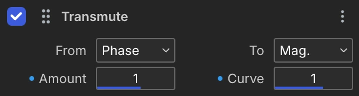

Turns one part of the sound into another: the level into the pitch, the phase into the pan, the position in the brush into the level. Each Transmute carries one route, so add a second and a third to run several at once.

- **From** – what is read from each band. See the first table.
- **To** – what it is written as. See the second table.
- **Amount** – how much is written. Its unit follows **To**: a gain, a span round the circle, beats, semitones, or a width between the speakers.
- **Curve** – bends the drive before it is written. 1 is straight, above 1 hugs the bottom, below 1 hugs the top, and negative turns it over.

Every route works the same way. Each band's **From** is read as a drive from 0 to 1, bent by **Curve**, scaled by **Amount**, and written to **To**. A route from a part to itself is a transfer curve on that part. A route into Time or Pitch moves each band by what it holds, so the loud bands travel and the quiet ones stay, or the other way round with a negative Curve.

| From / To | What is read / written                                             |
| --------- | ------------------------------------------------------------------ |
| **Mag.**  | The band's level.                                                  |
| **Phase** | The band's phase.                                                  |
| **Time**  | Where the band sits in the brush, from its left edge to its right. |
| **Pitch** | Where the band sits in the brush, from its bottom to its top.      |
| **Pan**   | Where the band sits between the speakers, from left to right.      |

**Hints**

- Put a **Phase→Mag.** and a **Mag.→Phase** either side of another effect. Everything between them shapes the phase instead of the level, and the pair hands the level back as the stroke found it.
- **Mag.→Mag.** with Curve at −1 turns the spectrum inside out: the noise floor comes up and the notes sink into it.

### Convolve

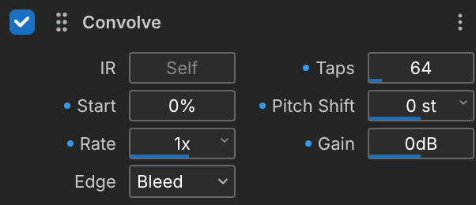

Prints the character of one sound onto another: reverbs, room tones, and stranger things when the impulse is not a room.

- **IR** – the impulse-response file, chosen from your open files.
- **Taps** – how many frames of the IR are read, which sets how long the tail runs.
- **Start** – where in the IR the first tap begins.
- **Pitch Shift** – transposes the IR, moving the resonances of the space it carries.
- **Rate** – how fast each tap steps through the sound. 1 is forward, −1 reverses, and other values stretch or squash the tail.
- **Gain** – the output gain of the convolution, in dB.
- **Edge** – what happens to taps that reach past the border.

**Hints**

- Any recording works as an IR, not just a room. The odder the source, the odder the result.
- **Start** past the attack keeps only the tail of a room.

### Attract

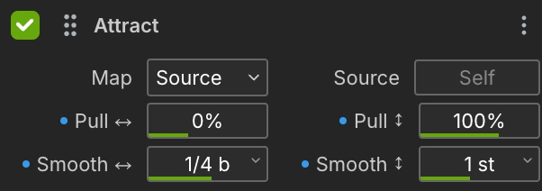

Pulls energy across time and pitch toward a map: a landscape of valleys that sound falls into. The energy moves rather than being filtered away.

- **Map** – what the landscape is made of. See the table below.
- **Source** – the file whose loud regions form the Source map's landscape, matched by absolute frequency. Leave it empty and the sound attracts toward itself.
- **Pull ↔ / ↕** – how far energy moves along each axis. Negative pushes away, and past 100 overshoots the target.
- **Smooth ↔ / ↕** – the width of the valleys, in beats and semitones. Narrow valleys snap precisely and ignore distant content. Wide valleys reach out and drag everything, and at the extreme the landscape flattens and the pull fades away.

| Map               | What it is                                                                        |
| ----------------- | --------------------------------------------------------------------------------- |
| **Source**        | The sound's own loud content, so strong partials capture their neighbours.        |
| **Scale**         | A valley at every note of the selected scale, so smear takes on a harmonic shape. |
| **Grid**          | Valleys on the snap grid's pitch and beat lines.                                  |
| **Modulator 1–3** | A modulator's field, so energy gathers where the pattern is bright.               |

**Hints**

- Paint the same spot repeatedly, or enable accumulate. Each pass gathers more content into the valleys and settles it there.
- Point **Map** at a modulator running an image, and the picture becomes terrain the sound falls into.

---

## Modulation

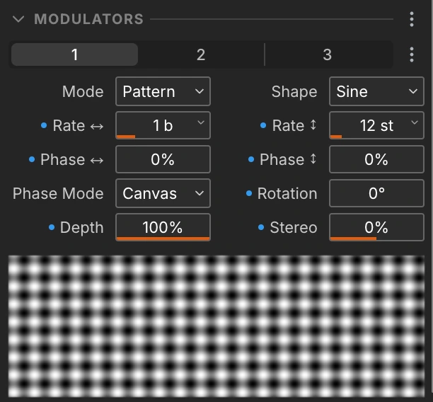

Anywhere a parameter label opens a menu with a **Modulation** section, that parameter can be modulated. Each step has **three modulators**, plus four macros and eight contextual sources.

Modulation is evaluated **per pixel**. A modulator is a 2D field over the spectrogram, not an LFO on a timeline, which is why strokes in different places pick up different values.

### How Modulation Amount Works

Think of the amount as a crossfade between the parameter's slider value and a fully modulated value, always clamped to the parameter's legal range.

- **Amount = 0%** – the parameter is exactly the value on its slider. No modulation is applied.
- **Amount = +100%** – the parameter ignores the slider and takes pure modulation, mapped from that parameter's minimum up to its maximum. It never goes out of range.
- **Amount = −100%** – the same, inverted: the modulator is mapped from maximum down to minimum.
- **Amounts in between** blend between the slider value and the modulated value.

Sources sweep along the slider, so a parameter with a logarithmic slider, such as a time scale, is swept logarithmically: each doubling takes the same amount of travel.

The parameter menu shows the resulting live range in real units next to the Modulation heading, so you can dial amounts in against concrete values rather than percentages. Once the amounts on a parameter add up to 100% or more, its own value no longer counts, and its box dims. If every source is a macro or a stroke property, the dimmed box shows the value the parameter resolves to.

### Modulator Modes

| Mode         | What it does                                                                                                               |
| ------------ | -------------------------------------------------------------------------------------------------------------------------- |
| **Pattern**  | Scrolls a 2D shape across time and pitch.                                                                                  |
| **Envelope** | Follows the painted region's own **Amplitude**, **Phase** or **Panning**, with a smoothing window in beats and a dB range. |
| **Sequence** | Reads a step grid you draw on. See [The Sequencer Grid](#the-sequencer-grid).                                              |

### Pattern Shapes and Images

**Waveforms:** Sine, Triangle, Square, Sawtooth, Pulse, Random, Smooth Noise.

**Procedural textures:** Quilt, Clouds, Cells, Bubbles, Craters, Ripples, Scratches, Swirls, Paper, Marble, Weave, Terrain, Flow.

**Selected Scale** steps the field by the notes of the scale set in the transport bar. See [Scales](#scales).

**Images.** A set of factory textures ships with the app, and you can drop your own in:

```
Documents/Noise Canvas/Textures/
```

They appear in the shape picker under a "User" group.

### Modulator Controls

- **Depth** – how far the modulator swings. Negative inverts it.
- **Rate ↔** – how many beats one cycle of the pattern spans. Bigger is slower. Two linked settings sit below the shortest span: **Grid** covers one cell of the time grid, **Brush** covers the width of the brush, and each follows that size as you change it. At the bottom, **Off**, the pattern stops varying along time.
- **Rate ↕** – how many semitones one cycle spans, with the same **Grid**, **Brush** and **Off** settings against the pitch grid and the height of the brush.
- **Rotation** – turns the pattern on the canvas, so it cuts diagonally.
- **Stereo** – reads the modulator at two places at once, one per channel. The gap is measured in the modulator's own cycle, so it works at any rate: at 100% the channels sit half a cycle apart. In Envelope mode the gap is time instead, up to half the file. Negative values swap the channels.
- **Phase Mode** – **Canvas** pins the pattern to the file, so separate strokes uncover one stationary field. **Brush** carries it along with each stroke.
- **Phase ↔ / ↕** – offsets the pattern's start position in each axis.

**Hints**

- One axis at **Off** gives stripes, both on gives a texture.

### The Sequencer Grid

In Sequence mode the modulator reads a grid instead of a shape. Steps run left to right in time and bands run bottom to top in pitch, and every cell holds one value between 0 and 1: the modulator's output wherever that cell lands on the canvas. A full cell drives the parameter to the top of its modulated range, an empty one to the bottom.

| Gesture                 | What it does                      |
| ----------------------- | --------------------------------- |
| Click a step            | Switches it on or off             |
| Drag up or down on it   | Sets its value                    |
| Drag sideways           | Switches a run of steps on or off |
| Right-drag              | Switches steps off                |
| Hold Shift while moving | Fine-tunes the value              |

A step switched off keeps its value and shows it as a faint line, so switching it back on returns the level you left. **Randomise** fills every cell with a random value, **Fill** switches the whole grid on, and **Clear** switches it off without losing the values.

**Steps ↔** and **Rows ↕** set the size of the grid, **Loop ↔** and **Loop ↕** set how far it stretches before repeating, and **Swing** pushes odd-numbered steps later. Both loops also take **Grid** and **Brush**, below their shortest span, so the sequence can run once per grid cell or once across the brush.

**Hints**

- Off is the bottom of the parameter's modulated range, not "no modulation". On Strength that is silence, but on a pitch parameter it is the lowest pitch.

### Contextual Sources

Beyond the three modulators and four macros, every modulatable parameter can also be driven by stroke properties:

**Iteration** (index across brush iterations) · **Time Pos.** (position across the file) · **Pitch Pos.** (position across the frequency range) · **Randomise** (a random value per stroke) · **Step** (index across steps) · **Pressure**, **Tilt X**, **Tilt Y** (pen tablet input).

### Nested Modulation

Modulator parameters are themselves modulatable. You can modulate modulator 2's rate with modulator 1, or drive a modulator's depth from a macro. One level of nesting is supported.

---

## Fill Grid

**Fill Grid** paints the current brush on every cell of the grid at once, instead of you dragging out each stroke by hand. The grid icon on a file's header runs it, as does **Edit → Fill Grid with Brush** (`Cmd/Ctrl+G`). The whole pass commits as one stroke, so one undo takes it back.

It has no settings of its own. The rhythm comes from the grid set in the transport, and the size and shape of each stroke comes from the brush. Change the grid and you change the pattern; change the brush and you change the sound.

Drag on the time legend to set a loop region and the fill covers only that span.

**Hints**

- Turn **Snap Time** or **Snap Pitch** off and that axis stops being divided, so one stroke spans it. With both off, a single stroke covers the whole file, which is how you apply a brush to everything at once.
- Every stroke uses the same brush, so a bare fill repeats one sound. A Random pattern on **Strength** gives each stroke its own level, and a sequencer on it draws a rhythm outright.

---

## Parameter Controls

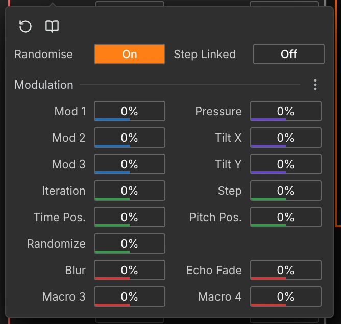

- **Drag** a value to change it. Where a parameter has preset values — musical beat divisions, semitone intervals and the like — a drag steps through them one at a time, so a stroke lands on 1/8 rather than 0.13.
- **Hold Shift while dragging** to leave the presets and set any value in between, three times slower than a plain drag. Let go of Shift and the drag steps again from wherever you left it.
- **Right-click** a value to pick from its list of preset values. A small chevron marks the values that have one.
- **Click** a value to type a number in.
- **Double-click the label** to reset a parameter to its default. This also clears every modulation amount on it.
- **Click the label** to open the parameter menu: modulation amounts, reset, exclusion from randomisation, step linking, and a **book icon** that opens this manual at the section explaining that parameter.

### Section Presets

The **⋮ menu** on an effect card or the modulator holds a list of presets for that section: starting points for the things it is usually asked to do. Pick one and the whole section changes to it. Hover a name to read what it does.

The **+** on the Presets heading keeps the section's current settings under a name of your own, and yours then appear in the same list. Every row has a **⋮** on hover: **Duplicate…** on any of them, plus **Rename…** and **Delete…** on your own. The ones that ship with the app cannot be renamed or deleted, so duplicating is how you start from one and make it yours. Modulator presets are not tied to the modulator you saved them from, so one saved on modulator 1 loads into any of the three.

Presets carry values only, so any modulation you have wired up survives loading one.

### Randomisation

Every section header has a **⋮ menu** with a Randomise block:

- **Amount** – how far values are allowed to move, as a percentage of each parameter's range. Values never leave their legal range.
- **Include Mod.** – whether modulation amounts are randomised too.
- **Randomise** – do it.

The Effects section also shuffles effect order and enabled states.

**Hints**

- Exclude a parameter from randomisation from its label menu, so you can lock the parts you like and re-roll the rest.

### Linking Parameters Across Steps

From a parameter's label menu, toggle the **link** icon to link it across all of the brush's steps. Changing it in one step then changes it everywhere. Useful for keeping brush size or blend mode consistent across a multi-step brush.

---

## Working with Files


Open a file from **File → Open**, from **Open Recent**, or by **dragging an audio file onto the window**, one at a time.

Open files stack vertically in the canvas column. Each header gives you:

- The **filename**, italic when it has unsaved changes, a **resolution badge**, and a **channel badge**.
- **BPM** – this file's tempo, which drives grid snapping and every beat-based parameter.
- **Onsets** – how sensitive the hit detector is for this file. See [Onsets](#onsets).
- **Split** – see [Splitting a File](#splitting-a-file).
- **Duplicate** – an editable copy, with its own history.
- **Minimise** – collapses it into the dock at the bottom of the canvas area. A docked file stays open and can still be used as a source. Click it to bring it back.
- **Fullscreen** – expands it to fill the canvas area.
- **Close**.

The active file has an orange border. Click any file to make it active, or use `Tab` and `Shift+Tab` to cycle through them.

Files you create in the app (New File, duplicates, stems) get a real path when you Save As.

### Mono and Stereo

A file is analysed with as many channels as the audio it came from, and the badge next to the resolution badge says which: **Mono** or **Stereo**.

The badge is a menu, so a file can go either way. The current painted state is rendered to audio, converted, and analysed again, which adds a node to the file's history rather than replacing anything.

- **Mono → Stereo** copies the single channel into both, so the file sounds the same until you paint on it. This is the step that gives the stereo effects something to place.
- **Stereo → Mono** mixes the two channels together at equal weight.

### Splitting a File

The split menu on each file header:

- **Split Harmonic and Percussive (HPSS)** – separates the file into harmonic and percussive layers.
- **Split into N Parts (NMF)…** – separates it into any number of components, learned from the file itself.
- **Split Drums / Bass / Other / Vocals (AI)** – neural stem separation. Not available on Intel Macs.

### Stem Groups

Every split produces a **stem group**. The parts stay ordinary files, and every brush and effect works on them unchanged, but they are bracketed together in the UI and share a colour.

- **Sync view** – zoom and scroll follow each other across all members.
- **Merge** – sums the group back into a new file. The parts stay open, and the round trip is lossless, so you can split, work heavily on one part, and merge back.
- **Close group** – closes every member with one confirmation.

### Onsets

Every file is scanned for **onsets**: the moments where a new sound starts. They are detected from the analysis itself rather than from the tempo, so they follow what is in the audio however loosely it was played.

Onsets show up in three places:

- **The onset strip** – a thin row of markers directly above the spectrogram, one line per detected hit. Brighter lines are stronger onsets.
- **Onsets sensitivity** – the **Onsets** control in the file header. It sets how far down this file's own level range a hit still counts: **0%** keeps only the loudest, **100%** keeps everything the detector found. The range is per file, so the same percentage means something comparable on a quiet pad and a hot drum loop. It applies to that file's path, so it survives closing and reopening.
- **Onset snapping** – set the time grid (**Beats**) to **Onsets** in the transport bar. Strokes then snap to detected hits instead of beat divisions.

Onsets also drive the [warp algorithms](#warp-algorithms). **Sharp** re-anchors phase at each detected onset when it moves audio, which is what keeps a moved drum hit cracking instead of smearing into pre-echo.

Onsets are recomputed around a stroke after you paint, so they track your edits.

**Hints**

- Snap to onsets with **Anchor** on **Corner**, and a stroke lands exactly on a transient rather than near it.
- Lower the sensitivity if a busy file is being over-anchored by Sharp, and raise it if quiet hits are smearing.

### The Level Strip

A thin strip sits directly above each file's spectrogram, showing how loud the finished audio is at every moment. Read it left to right like the file itself, and it tells you where you are running out of room.

| Colour                 | What it means                                                   |
| ---------------------- | --------------------------------------------------------------- |
| **Dark**               | Quiet, or nothing at all.                                       |
| **Light, up to white** | A healthy level.                                                |
| **Yellow**             | Close to full scale. Still fine, but there is no headroom left. |
| **Red**                | Out of headroom. The deeper the red, the further past it went.  |

### Navigating the Canvas

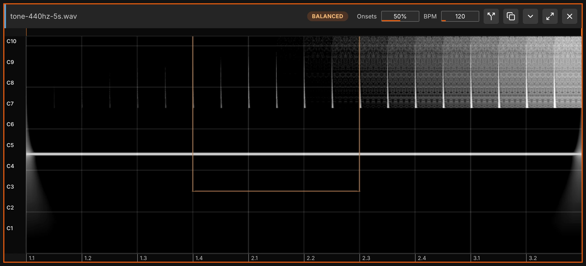

Time axis, on the spectrogram itself:

- **Right-click drag** – pan, with momentum.
- **Pinch**, or **`Cmd`/`Ctrl` + scroll** – zoom in time, around the cursor.
- **Two-finger horizontal scroll** – pan.
- **Vertical scroll** – scrolls the file list rather than the file.

Pitch axis, on the **pitch legend** down the left edge:

- **Drag left or right** – zoom in pitch, around the point you grabbed.
- **Drag up or down** – scroll through the frequency range, once zoomed in.

When zoomed in far enough, the pitch legend turns into a piano keyboard so you can see where the notes are.

On the **time legend** along the bottom:

- **Click** – set the playback start position, snapped to the grid.
- **Drag** – set a loop region, which also moves the playback start to its beginning.

Zoom and scroll are remembered per file across restarts, and files in a [stem group](#stem-groups) with **Sync view** on share all four: time zoom, time scroll, pitch zoom, pitch scroll.

---

## History

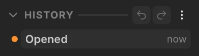

Every edit is captured in the **History** panel, as a branching tree rather than a flat undo list. If you undo a few steps and then paint something new, the steps you undid stay as a separate branch you can return to at any time.

Each node is a snapshot of the file at that point. The current state is highlighted, and every node shows its label and how long ago it was made.

- **Jump to any state** – click a node to return the file to it.
- **Undo / Redo** – the arrows at the top of the panel step to the parent node, or to the most recently visited child. `Cmd/Ctrl+Z` and `Shift+Cmd/Ctrl+Z` do the same.
- **Rename** – double-click a node, or right-click → Rename.
- **Favourite** – right-click → Favourite to star the states you like.
- **Export branch…** – renders the audio for that node's lineage, one numbered WAV per node from the root down. In the Ableton extension there is also **Export branch to Live**.
- **Delete branch** – removes a node and everything downstream of it.

The panel's **⋮ menu** adds **Export History…**, **Export Favourites…**, and **Purge History**, which shows how much disk the tree is using and clears it while leaving the current state untouched.

History lives on disk per file, so the tree survives quitting and reopening. It is deleted only when you close the file.

---

## Transport and Output


The transport bar, left to right:

- **Link** – toggles **Ableton Link**, syncing tempo and start/stop with other Link-enabled apps on the network. The tooltip shows the peer count, and **right-click** the button for latency compensation.
- **Play / Stop** (`Space`), **Loop**, and **Auto-play stroke**, the brush icon. With Auto-play on, each stroke plays back the region you just painted.
- **Playback time**.
- **Beats / Snap** and **Semis / Snap** – grid spacing and snapping per axis. Set the pitch grid to **Scale** to snap to the selected scale, and the time grid to **Onsets** to snap to the file's detected hits. See [Scales](#scales) and [Onsets](#onsets).
- **Swing** – swing feel for the time grid. 0% is straight, around 67% is a triplet feel, and 100% shifts odd grid lines by half a cell.
- **Tonic / Type** – the selected scale. See [Scales](#scales).
- **Output meter**.
- **Auto-limit** – on by default. It holds each stroke's own level down as you paint it, leaving the audio around it untouched, and on audio that is already loud it holds the stroke to the level that was there. It is baked into the stroke, so undo removes it along with the paint, and switching it off only affects what you paint next. Either way, [the level strip](#the-level-strip) shows where the headroom went: with Auto-limit on, red marks what it is holding down for you, and with it off, red is clipping.
- **Re-analyse** – redraws each stroke as the analysis of the audio it made, so the picture settles into what plays, even for edits that only move phase. Off, the canvas keeps exactly what you painted, and commits are faster. The sound is the same either way. Like Auto-limit, it is read at the end of each stroke.
- **?** – outlines every area of the window at once. See [Getting Help](#getting-help).

**Hints**

- Switch **Auto-limit** off to paint as loud as the effect makes it, and watch the level strip for clipping.

---

## Menus

The menus live in the window rather than in the system menu bar, so they read the same on every platform and inside Ableton Live. The right-hand end of the bar holds two things: how much of the graphics memory budget the open files hold, and the **?** button that opens the overlay.

Memory climbs with the length and resolution of everything you have open, not with how much you paint. Past about 90% a new file may be refused, or analysed at a lower resolution. Close a file to make room.

**File**

- **New** (`Cmd/Ctrl+N`) – creates an empty file, with a sample rate, BPM and length in beats.
- **Open…** (`Cmd/Ctrl+O`) / **Open Recent** – loads existing audio. The recent list holds 20 files and persists across sessions.
- **Save** (`Cmd/Ctrl+S`) – writes back over the original.
- **Save As…** (`Cmd/Ctrl+Shift+S`).
- **Save Version** (`Cmd/Ctrl+Alt+S`) – saves a numbered copy alongside the original without overwriting it.
- **Close File** (`Cmd/Ctrl+W`).
- **Export Image…** – saves the active file's spectrogram as a PNG, for artwork rather than for audio. A live preview shows what you will get.
  - **Colour** – Editor keeps the app's own look. Mono, Magma, Viridis and Ice restyle it, and Random rolls a new palette each time you pick it.
  - **Shape** – 1:1, 4:5, 3:2, 16:9, or 9:16 for a phone screen.
  - **Size** – 2K, 4K or 8K along the long edge.
  - **Poster** – adds the file's name as a caption underneath.
- **Export History…**.
- **Quit** – on macOS this lives in the **Noise Canvas** menu instead.

**Edit**

- **Undo / Redo** (`Cmd/Ctrl+Z`, `Shift+Cmd/Ctrl+Z`).
- **Fill Grid with Brush** (`Cmd/Ctrl+G`) – see [Fill Grid](#fill-grid).
- **Restore Original** – reloads the unedited file.
- **Duplicate File** (`Cmd/Ctrl+D`).
- **Double Length / Half Length** – stretches or shrinks the file's length.

**View**

- **Compact UI** (`Cmd/Ctrl+Shift+C`).

**Help**

- **Manual** (`Cmd/Ctrl+/`) – opens this document in a window inside the app.
- **Run Walkthrough** – replays the first-run tour. See [Getting Help](#getting-help).
- **Check for Updates…** – looks for a newer version. If one exists the app offers to download it, then installs it when you restart. On macOS this also sits in the **Noise Canvas** menu.

Re-analysing a file is not in these menus. The resolution badge in each file's header does it, so it acts on the file you point at rather than on whichever one is active. See [Analysis Resolution](#analysis-resolution).

---

## Keyboard Shortcuts

File and Edit shortcuts (`Cmd/Ctrl+N`, `+O`, `+S`, `+W`, `+D`, …) are listed under [Menus](#menus).

| Key                   | Action                                                 |
| --------------------- | ------------------------------------------------------ |
| `Space`               | Play / stop                                            |
| `Arrow keys`          | Move the brush by one grid cell                        |
| `Enter`               | Apply the brush at the current position                |
| `-` / `=`             | Decrease / increase the time grid                      |
| `Shift` + `-` / `=`   | Decrease / increase the pitch grid                     |
| `Tab` / `Shift+Tab`   | Next / previous file                                   |
| `1`–`9`, `0`          | Select the top palette's first ten brushes             |
| `a`–`z`               | Select the brush bound to that key                     |
| Hold `Shift` + click  | Pick a source file and position                        |
| `Cmd`/`Ctrl` + scroll | Zoom                                                   |
| Right-click drag      | Pan                                                    |
| `Cmd/Ctrl+Z`          | Undo                                                   |
| `Shift+Cmd/Ctrl+Z`    | Redo                                                   |
| `Cmd/Ctrl+Shift+C`    | Toggle compact UI                                      |
| `?`                   | Outline every area (see [Getting Help](#getting-help)) |
| `Cmd/Ctrl+/`          | Open this manual                                       |

---

## Getting Help

Five places, each answering a different question.

| Surface            | How you get there                                         | What it answers                     |
| ------------------ | --------------------------------------------------------- | ----------------------------------- |
| **Tooltip**        | Hover any control for a second                            | What does this one control do?      |
| **Parameter menu** | Click a parameter's label, then the book icon             | …and where is it explained in full? |
| **`?` overlay**    | The **?** button in the menu bar, or the `?` key          | What is all this?                   |
| **Walkthrough**    | Offered on first launch; **Help → Run Walkthrough** after | Where is everything?                |
| **This manual**    | **Help → Manual** (`Cmd/Ctrl+/`), or any book icon        | What does this do, exactly?         |

The `?` overlay dims the window and brightens whatever you point at, with a description beside it. It covers regions, parameters and every button and widget, down to individual controls, so pointing at something is the way to ask what it is. Each card links to the part of this manual that explains it. Menus and popovers are covered too: open one first, then press `?`, and the controls inside answer like any other. Press `?` or `Esc` to close it.

The first-run walkthrough asks you to do two things: add an effect, and paint a stroke. You finish it having built a working brush by hand.

The manual has a search box at the top that filters to matching sections.

Found a bug? Report it on the [issues page](https://github.com/robclouth/noise-canvas/issues).

---

## Where Things Are Saved

```
Documents/Noise Canvas/Presets/               brush presets (.json)
Documents/Noise Canvas/Presets/Effects/       your effect presets
Documents/Noise Canvas/Presets/Modulators/    your modulator presets
Documents/Noise Canvas/Palettes/              palettes (.json)
Documents/Noise Canvas/Textures/              your own modulator images
~/.noise-canvas/models/                       downloaded AI separation models
<user data>/history/<fileId>/                 per-file history trees
```

`<user data>` is Electron's per-app data directory: `~/Library/Application Support/…` on macOS, `%APPDATA%\…` on Windows, `~/.config/…` on Linux. History is the one that grows: each file's tree is stored there until you close the file or use **Purge History**, and the History panel's ⋮ menu shows the current size.

Your open files, their zoom and scroll positions, BPMs, brushes and window settings are all persisted, so the app reopens where you left it.

---

## Working with Ableton Live

**As an external sample editor:**

1. In **Live Preferences → File/Folder**, set **Noise Canvas** as your _External Sample Editor_.
2. In Live, right-click a sample and select **Edit**.
3. The sample opens in Noise Canvas.
4. Make your edits, save, and close.
5. Live reloads the updated version.

**As a Live extension (beta).** Noise Canvas also builds as an Ableton Live 12 extension (`.ablx`), which embeds the whole editor inside Live. Right-click an audio clip → **Edit in Noise Canvas**, edit, and render straight back into the set as a new clip, including **Export branch to Live** from the history panel. This needs a Live build with Extensions support, and ships alongside each release. See [`src/extension/README.md`](../src/extension/README.md).

**Ableton Link** works either way. Enable it in the transport bar to lock tempo and transport to Live, or to anything else on the network.
